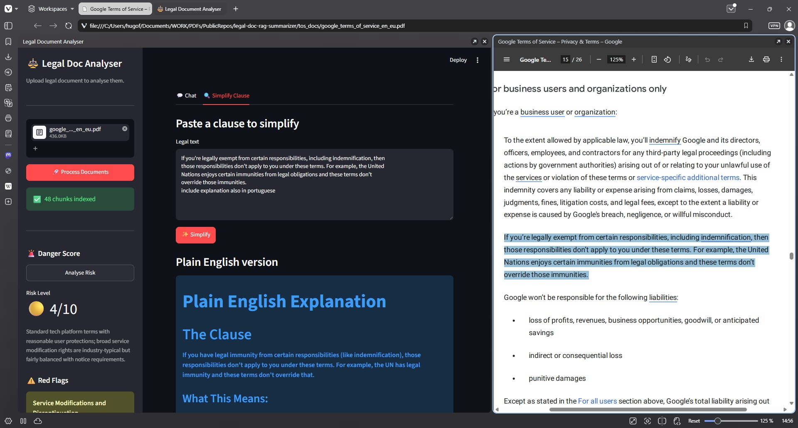
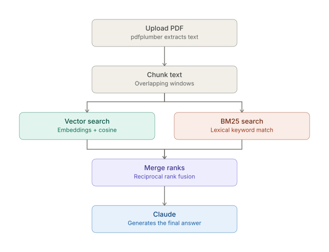
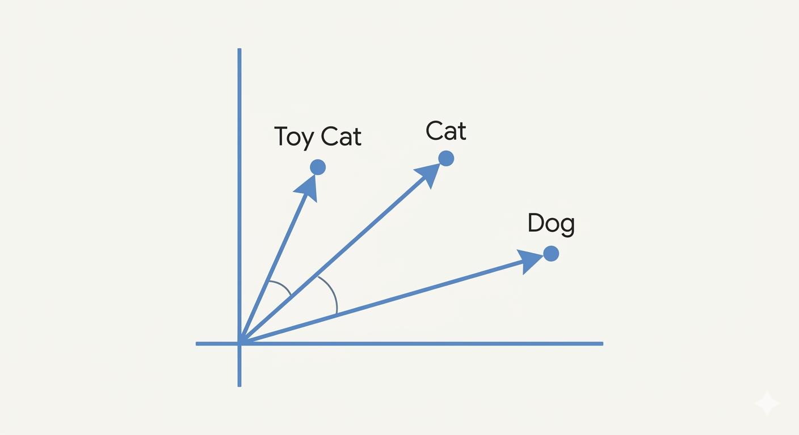
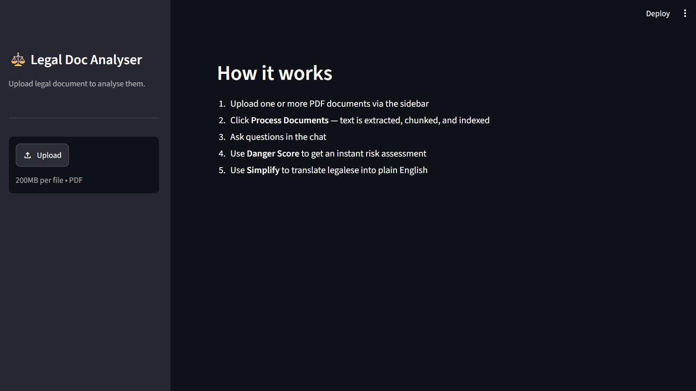
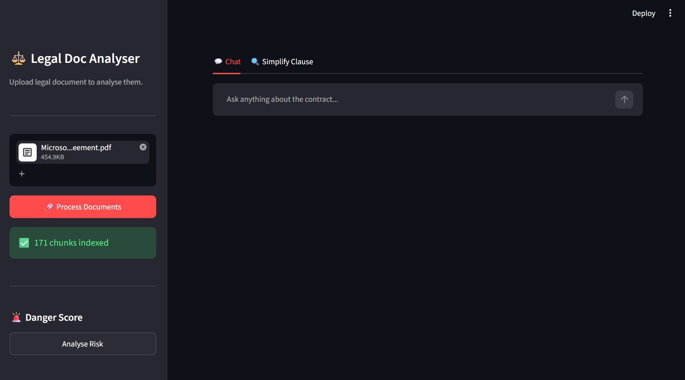

# legal-doc-rag-summarizer

> A RAG-powered Streamlit app that reads legal PDFs, answers questions about them, scores their risk, and simplifies legalese into plain English — built with Python, HuggingFace embeddings, BM25, and the Claude API.

> 💾 If this project looks useful, starring it now means you won't lose it later.

🗓️ **Status: June 2026**

---
## Picture this

You're about to register to an app just to see if it suits your needs, you just want to try it out...

You fill the forms and click next... then it complains about the *impossible* **CAPTCHA**...
you squint at the screen, try three times... finally you did it! Click next...

Now it complains because you didn't check the *"I have read and agree to the Terms of Service."*
You check it in a hurry and smash that next button. 

**FINALLY!!! 🥇🥇🥇**

Did you read it? Those terms you just "said" you did?

Of course not. No one reads that. After all, it is probably the biggest lie on the internet,
repeated billions of times every day.

But the devil is in the details. Somewhere in that wall of legal text there might be a clause
that lets the company sell your data, terminate your account without notice, or opt you in to
arbitration instead of a court. **You just agreed to it.**

With this tool you upload a PDF, and a few seconds later you have a risk score, a list of
red flags, a chat interface where you can ask anything about the document, and a way to paste
any clause and get it back in plain, everyday language anyone can understand (or even in any other
language you ask for).



---

⚠️ **Heads up**

This is a personal learning project — not an official Anthropic resource.
It may contain errors, simplifications, or opinionated choices made for clarity over correctness.
Think of it as a **hands-on RAG tutorial**: each part builds on the previous one, so you always know why the next step exists.

Before you dive in, keep a few things in mind:

1. **Fast-Paced AI Evolution:** The AI landscape moves fast. Specific libraries or model names may change, but the RAG concepts taught here will stay relevant.
2. **Not production-ready:** This project was built to learn and teach. It has not been tested or hardened for production use.
3. **Built with AI Assistance:** This README was written with AI help, mainly for English refinement. The architecture, curriculum, and all technical decisions are my own.

> This project was made with what I've learned in [Building with the Claude API](https://anthropic.skilljar.com/claude-with-the-anthropic-api) course. If you enjoy this format, that course is the natural next step. 


---

# Key Concepts Demonstrated

✅ PDF text extraction
<br>✅ Text chunking strategies
<br>✅ HuggingFace sentence embeddings
<br>✅ Vector search with cosine similarity
<br>✅ BM25 lexical search
<br>✅ Hybrid retrieval with Reciprocal Rank Fusion (RRF)
<br>✅ RAG pipeline with Claude (Haiku)
<br>✅ Assistant prefill for structured JSON output
<br>✅ Streamlit UI

<a name="table-of-contents_"></a>

---

## Table of Contents

- [What is RAG?](#what-is-rag_)
- [Project Architecture](#project-architecture_)
- [Requirements](#requirements_)
- [Setup](#setup_)
- [Project Structure](#project-structure_)
- [Part 01 - The Naive Approach: Sending the Whole PDF to Claude](#part-1)
- [Part 02 - Divide and Conquer: Chunking the Document](#part-2)
- [Part 03 - Finding What Matters: Vector Search with Embeddings](#part-3)
- [Part 04 - Exact Match: BM25 Lexical Search](#part-4)
- [Part 05 - Best of Both Worlds: Hybrid Retrieval with RRF](#part-5)
- [Part 06 - How Risky Is This Contract? The Danger Score](#part-6)
- [Part 07 - Answering Questions and Simplifying Clauses: RAG in Action](#part-7)
- [Part 08 - Wrapping It All Up: The Streamlit Interface](#part-8)
- [Next Steps & Resources](#next-steps--resources_)
- [Get in Touch](#get-in-touch_)


<a name="what-is-rag_"></a>

---

## What is RAG?

#### ⚡ Quick Navigation: [⬅️ Table of Contents](#table-of-contents_) | [Project Architecture ➡️](#project-architecture_)

Imagine asking Claude a very specific question about a 40-page contract, like *"Can the vendor terminate this agreement without notice?"*. Claude is smart, but it only knows what's inside its context window at that moment. If you don't feed it the right page, it simply can't answer correctly, no matter how capable the model is.

**RAG opens that door.**

**Retrieval-Augmented Generation (RAG)** is a technique for answering questions about documents that are too large to fit comfortably into a single prompt. Instead of stuffing the entire PDF into every request, RAG retrieves only the relevant pieces first, then hands those pieces to Claude alongside the question.

**A practical example:**

❌ **Without RAG:** You paste all 40 pages of a contract into the prompt every time you ask a question. It works, technically, but it's slow, costs more tokens, and Claude's accuracy tends to drop as the prompt grows longer.

✅ **With RAG:** The document is split into chunks ahead of time. When you ask *"Can the vendor terminate without notice?"*, the system searches those chunks, finds the termination clause, and sends only that excerpt to Claude. Faster, cheaper, and more focused.

| | Without RAG | With RAG |
|---|---|---|
| Prompt size | Entire document, every time | Only the relevant excerpts |
| Cost per question | High | Low |
| Scales to large/multiple docs | Poorly | Well |
| Accuracy on long documents | Drops with size | Stays focused |
| Setup effort | None | Requires preprocessing |

This trade-off, a bit of upfront engineering in exchange for speed, cost, and accuracy, is the whole point of RAG.

### The pieces that make it work

Across this tutorial series, we build a RAG project one layer at a time:

- **Chunking** - breaking the PDF into smaller, searchable pieces
- **Embeddings** - turning each chunk into a vector so we can search by meaning, not just keywords
- **Vector search** - finding chunks that are semantically related to the question
- **BM25 (lexical search)** - catching exact term matches that embeddings can miss (a clause number, a defined term, a specific party name)
- **Hybrid retrieval (RRF)** - combining both search methods, since each one catches things the other tends to miss
- **Claude** - the final step, turning the retrieved excerpts into an actual answer, a danger score, or a plain-English rewrite of a clause

By the end of Part 08, all of this is wrapped in a Streamlit interface, so you can upload a contract and interact with the whole system without touching the terminal.

> ⚠️ As mentioned earlier in this README, this is a learning project, not production-ready software. It's meant to give you a hands-on, working mental model of how RAG systems are actually built.

### Watch this 10 minute video from IBM - What is Retrieval-Augmented Generation (RAG)?
[](https://youtu.be/T-D1OfcDW1M)

[↑ Back to Table of Contents](#table-of-contents_)

<a name="project-architecture_"></a>

---

## Project Architecture

#### ⚡ Quick Navigation: [⬅️ What is RAG?](#what-is-rag_) | [Requirements ➡️](#requirements_)

Let's be honest about what this actually is: a single Python script. No microservices, no message queues, no orchestration framework. Some people would call it a "pipeline" because the words sound nice in a README, but it's really just a sequence of functions, each one feeding the next.

Here's the full flow, in order:

1. **Upload** - one or more PDFs are uploaded via the Streamlit sidebar.
2. **Extract** - `extract_text_from_pdf` pulls raw text out of each PDF using `pdfplumber`.
3. **Chunk** - `chunk_text` splits that raw text into overlapping chunks, so context isn't lost at the edges.
4. **Index (twice, in parallel)**
   - `embed_texts` turns every chunk into a vector using a local `SentenceTransformer` model.
   - `tokenize_texts` + `BM25Okapi` builds a lexical index over the same chunks.
5. **Ask a question** - the user types a question in the chat, or pastes a clause to simplify.
6. **Retrieve** - `hybrid_retrieve` embeds the question, runs both vector search and BM25 search, then merges the two rankings with Reciprocal Rank Fusion (`rrf_merge`).
7. **Answer** - the retrieved chunks are dropped into a prompt template and sent to Claude (`ask_claude`), which returns one of three things depending on what was asked: a direct answer, a plain-English rewrite of a clause, or a structured danger score.
8. **Display** - Streamlit renders the result in the chat, the "Simplify" tab, or the sidebar's risk metric.

Nothing here runs in the background, nothing is queued, nothing is distributed. One script, one process, top to bottom. That simplicity is intentional: the goal of this series is to understand *how* each RAG concept works, not to build infrastructure.


*A visual map of how the pieces fit together.*

[↑ Back to Table of Contents](#table-of-contents_)

<a name="requirements_"></a>

---

## Requirements

#### ⚡ Quick Navigation: [⬅️ Project Architecture](#project-architecture_) | [Setup ➡️](#setup_)

- Python 3.10+
- An Anthropic API key → [console.anthropic.com](https://console.anthropic.com)

[↑ Back to Table of Contents](#table-of-contents_)

<a name="setup_"></a>

---

## Setup

#### ⚡ Quick Navigation: [⬅️ Requirements](#requirements_) | [Project Structure ➡️](#project-structure_)

### 1. Clone the repository

```bash
git clone https://github.com/hasff/legal-doc-rag-summarizer.git
cd legal-doc-rag-summarizer
```

### 2. Create a virtual environment

```bash
# Windows
py -m venv venv

# macOS / Linux
python -m venv venv
```

```bash
# Windows
venv\Scripts\activate

# macOS / Linux
source venv/bin/activate
```

### 3. Install dependencies

```bash
pip install -r requirements.txt
```

### 4. Configure environment variables

```bash
cp .env.example .env
```

Add your Anthropic API key to `.env`:

```
ANTHROPIC_API_KEY="your_key_here"
```

> ⚠️ Never commit your .env file. Add it to .gitignore.

[↑ Back to Table of Contents](#table-of-contents_)

<a name="project-structure_"></a>

---

## Project Structure

#### ⚡ Quick Navigation: [⬅️ Setup](#setup_) | [Part 01 ➡️](#part-1)

```
legal-doc-rag-summarizer/
├── .env.example
├── .gitignore
├── README.md
├── requirements.txt
│
├── app_v1.py          ← Part 01: naive full-PDF approach
├── app_v2.py          ← Part 02: chunking
├── app_v3.py          ← Part 03: vector search
├── app_v4.py          ← Part 04: BM25 lexical search
├── app_v5.py          ← Part 05: hybrid retrieval (RRF)
├── app_v6.py          ← Part 06: danger score
├── app_v7.py          ← Part 07: RAG Q&A + simplify
├── app_v8.py          ← Part 08: Streamlit UI
│
└── tos_docs/          ← place your PDF files here (git-ignored)
```

[↑ Back to Table of Contents](#table-of-contents_)

<a name="part-1"></a>

--- 

# Part 01 - The Naive Approach: Sending the Whole PDF to Claude

#### ⚡ Quick Navigation: [⬅️ Project Structure](#project-structure_) | [Part 02 ➡️](#part-2)

> 📒 **What you'll learn:** How to call the Claude API with a full PDF text, why this approach works — and why it shouldn't be your first choice.

---

### Theory

Before introducing RAG, it's worth seeing the naive approach in action. The simplest thing you can do with a PDF and an LLM is extract all the text and dump it directly into the prompt.

It works. Claude will read it, find what you asked for, and give you a solid answer. But there's a cost, literally and figuratively.

- Every token in that document gets processed, even if only 2% of it is relevant to your question.
- Large documents can exceed Claude's context window entirely.
- Larger prompts cost more, run slower, and increase the risk of the model losing focus or hallucinating.

This part intentionally shows you the problem first, before introducing the solution. That's the whole point.

---

### Install dependencies

> 💡 This part introduces `anthropic`, `python-dotenv`, and `pdfplumber`. If you followed the setup step and ran `pip install -r requirements.txt`, you already have them. If not, install them now:

```bash
pip install anthropic python-dotenv pdfplumber
```

- `anthropic` — the official Python SDK for the Claude API. This is how your code talks to Claude.
- `python-dotenv` — loads environment variables from a `.env` file. Keeps your API key out of the source code.
- `pdfplumber` — extracts text from PDF files. Handles multi-page documents cleanly and works well with real-world PDFs.

---

### Code walkthrough

> 📄 **File:** `app_v1.py`

#### Setup and clients

```python
# Standard library
import os

# PDF Reader
import pdfplumber

# Anthropic
import anthropic

# Environment
from dotenv import load_dotenv
load_dotenv()

# ── Clients ──────────────────────────────────────────────────────────────────
anthropic_client = anthropic.Anthropic(api_key=os.getenv("ANTHROPIC_API_KEY"))

# 🚨 Models can change over time - the following are valid at the time of this writing Jun 2026
# CLAUDE_MODEL = "claude-sonnet-4-6"
CLAUDE_MODEL = "claude-haiku-4-5"
```

`load_dotenv()` reads your `.env` file and makes `ANTHROPIC_API_KEY` available to `os.getenv`. The Anthropic client is initialized once at module level and reused across all API calls. We're using Claude Haiku here — fast and cost-effective, a good fit for a tutorial project.

---

#### PDF extraction

```python
def extract_text_from_pdf(uploaded_file) -> str:
    with pdfplumber.open(uploaded_file) as pdf:
        return "\n\n".join(
            page.extract_text() or "" for page in pdf.pages
        )
```

This function opens the PDF, extracts text from every page, and joins them with double line breaks. The `or ""` handles pages that return `None` (blank pages, scanned images without OCR, etc.). Simple and reliable.

---

#### Calling the Claude API

```python
SYSTEM_CONTRACT = """You are a legal analyst specialising in contracts and terms of service.
Your job is to help users understand documents in plain, clear language.
Be precise, cite specific clauses when relevant, and only flag clauses that are
genuinely unusual or significantly disadvantageous compared to industry standards."""

def ask_claude(system: str, query: str) -> str:
    msgs = [{"role": "user", "content": query}]

    response = anthropic_client.messages.create(
        model=CLAUDE_MODEL,
        max_tokens=1024,
        system=system,
        messages=msgs
    )

    return response.content[0].text
```

The system prompt is the personality and constraint layer — it tells Claude what role to play and how to behave across every call. It travels with every request and keeps the model focused on legal analysis rather than general conversation.

The `messages` represents the conversation history. Right now it holds a single user message containing the full PDF text (you'll see next 👇). In later parts, this function stays untouched. What changes is what we pass to it.

---

#### The main entry point

```python
if __name__ == "__main__":

    file_path = PDFS_DIR / "danger_zone_rag_test.pdf"

    pdf_text = extract_text_from_pdf(file_path)

    question = f"""Hey claude can you explain to me whats up with the 'AI agent' info in the doc? 
    Also tell me in what parts the document it appears. 
    Here is the info: {pdf_text}"""

    answer = ask_claude(SYSTEM_CONTRACT, question)
    print(f"🤖 says:\n", answer)
```

We're using `danger_zone_rag_test.pdf` — a synthetic document built specifically for this tutorial. It contains intentional semantic ambiguity: the word "agent" appears in three completely different legal contexts (legal agency, AI agents, and real estate agents). That's not an accident. It's designed to expose the limits of naive retrieval in later parts.

Here, the entire PDF text is pasted directly into the question. Claude receives it all.

[⬆️ **`Part 1`**](#part-1)

---

### Run it

> On macOS / Linux, replace `py` with `python` or `python3`. I'm on Windows, so from here on all terminal examples show the Windows version only.

```bash
py app_v1.py
```

> ⚠️ **Note on potential file corruption**
> This project intentionally avoids `try/except` blocks around file operations, to keep the code focused on the RAG concepts being taught, not on defensive programming.
>
> If you get a `PdfminerException: Unexpected EOF` (or similar `PSEOF` error) when running this script, your local copy of `danger_zone_rag_test.pdf` is likely corrupted. This can happen during clone/download if Git or your OS converts line endings on binary files.
>
> **Fix:** re-download the PDF directly from the repo (don't `git pull` over a dirty working copy) or re-clone the repository fresh. If the problem persists, open an issue.
>
> 💡 Alternatively, feel free to swap in your own PDF file. Just update the file path in the script accordingly, any legal-style document works for following along. 


Here's the output:

```
(venv) PS C:\Users\hugof\Documents\WORK\PDFs\PublicRepos\legal-doc-rag-summarizer> py .\app_v1.py  
⏱️ PDF extracted

😎 says:
 Hey claude can you explain to me whats up with the 'AI agent' info in the doc? 
    Also tell me in what parts the document it appears. 
    Here is the info: SYNTHETIC LEGAL DOCUMENT
RAG Danger Zone Test — Ambiguous Sections
SYNTHETIC DOCUMENT — FOR RAG PIPELINE TESTING PURPOSES ONLY. This document contains intentionally
ambiguous language designed to stress-test retrieval systems. It does not represent any real legal agreement.
## Section 1: Data Processing and Data Protection
[AMBIGUITY TYPE: Same keyword — different legal domains]
1.1 Personal Data Processing
The Controller shall process personal data in accordance with the principles of lawfulness, fairness,
and transparency. Processing activities include collection, storage, and erasure of data subjects'
personal information. The data processor must implement appropriate technical measures to ensure
data integrity and prevent unauthorised access. Any transfer of personal data to third countries
requires adequate safeguards under applicable data protection regulation (Ref: DPR-2024-EU-001).
1.2 Industrial Data Processing
The Operator shall process raw material data using certified industrial processing units. Processing
cycles must not exceed 48 hours per batch. Data logs from processing equipment must be retained
for audit purposes for a minimum of five years. Any transfer of processed materials to third-party
facilities requires prior written consent. The Operator is responsible for ensuring processing integrity
and preventing contamination of data streams. Processing failures must be reported under incident
code INC-PROC-0x44A.
1.3 Financial Data Processing
Transaction processing systems shall handle payment data in compliance with PCI-DSS standards.
Processing latency must remain below 200ms for standard operations. Failed processing attempts
must trigger automated rollback procedures. Data processed through the payment gateway
(Gateway ID: PGW-7731-B) is subject to quarterly audit by an independent third party. Processing
fees are non-refundable once the transaction enters the cleared state.
## Section 2: Termination Rights and Termination Procedures
[AMBIGUITY TYPE: Same term — contract law vs. employment law vs. system shutdown]
2.1 Contract Termination
Either party may terminate this Agreement upon thirty (30) days written notice. Termination for
cause may occur immediately upon written notice if the breaching party fails to cure the material
breach within fifteen (15) days of notification. Upon termination, all licences granted herein shall
cease, and the receiving party must return or destroy all confidential materials. Termination does not
relieve either party of obligations accrued prior to the termination date (Case Ref:

LEG-TERM-2024-089).
2.2 Employment Termination
The Company reserves the right to terminate employment relationships in accordance with
applicable labour law. Termination without cause requires payment of statutory severance.
Termination for gross misconduct may be immediate and without severance entitlement. All
terminated employees must return company property, including access credentials, within 24 hours
of the termination notice. Termination packages are subject to approval by the Human Resources
Committee under Policy HR-TERM-v4.2.
2.3 System Process Termination
Automated termination of system processes shall occur upon detection of memory threshold
breaches exceeding 95% utilisation. The watchdog daemon (PID monitoring ref: SYS-WD-001) is
authorised to issue SIGTERM signals to non-responsive processes. Graceful termination must be
attempted before forced termination via SIGKILL. Termination events are logged to the central audit
trail under error code ERR-PROC-TERM-0xDEAD. Repeated abnormal terminations trigger
escalation to the on-call infrastructure team.
## Section 3: Agent Responsibilities and Agent Conduct
[AMBIGUITY TYPE: 'Agent' — legal agent vs. AI agent vs. real estate agent]
3.1 Legal Agency
An agent acting on behalf of the Principal must operate within the scope of the authority granted
under the Power of Attorney (Document ID: POA-2024-447). The agent is bound by fiduciary duties
and must disclose all conflicts of interest. Unauthorised actions taken by the agent outside the
scope of granted authority shall not bind the Principal. The agent must maintain accurate records of
all transactions conducted on behalf of the Principal and provide quarterly reporting (Form
AG-REP-Q).
3.2 AI Agent Conduct
Autonomous AI agents deployed within this system must operate within predefined tool-use
boundaries. Each agent is assigned a permission scope (Scope ID: AI-AGT-PERM-v2) that limits its
ability to invoke external APIs, modify persistent storage, or initiate financial transactions. AI agents
must log all tool calls to the central audit trail. Agents detected operating outside their permission
scope are subject to automatic termination and incident escalation under INC-AI-BOUNDARY-001.
Human oversight is mandatory for any agent action exceeding monetary threshold EUR 500.
3.3 Real Estate Agent Obligations
Licensed real estate agents must act in the best interest of their client throughout the property
transaction lifecycle. Agents are prohibited from representing conflicting interests in the same
transaction without written disclosure and informed consent from both parties. Commission
structures must be disclosed prior to engagement (Disclosure Form: REA-DISC-2024). Agents must

comply with anti-money laundering regulations and perform due diligence on all parties. Failure to
comply may result in licence suspension under REG-REA-CONDUCT-v7.
## Section 4: Security Protocols and Security Incidents
[AMBIGUITY TYPE: 'Security' — cybersecurity vs. physical security vs. financial security]
4.1 Cybersecurity
All systems must implement multi-factor authentication and encrypt data at rest using AES-256.
Security incidents involving unauthorised access must be reported within 72 hours under GDPR
Article 33. Penetration testing (Ref: SEC-PENTEST-2024-Q2) must be conducted bi-annually.
Security patches classified as Critical (CVSS score >= 9.0) must be applied within 24 hours of
release. The Security Operations Centre (SOC-ID: SOC-EU-PRIMARY) monitors all network activity
and responds to alerts under SLA-SEC-001.
4.2 Physical Security
Access to restricted premises requires biometric authentication and a valid security clearance badge
(Badge Class: SEC-BADGE-RED). Security incidents involving unauthorised physical access must
be reported to the Facilities Security Officer within 1 hour. CCTV footage is retained for 30 days
under physical security policy PHY-SEC-v3. Security personnel are authorised to detain individuals
suspected of trespassing pending law enforcement arrival. All security incidents are logged under
incident code PHY-INC-XXXX.
4.3 Financial Security (Collateral)
The Borrower must provide adequate security in the form of collateral assets with a minimum
valuation of 120% of the principal loan amount. Security interests must be registered with the
relevant authority (Registration Ref: FIN-SEC-REG-2024). In the event of default, the Lender is
entitled to enforce the security and liquidate collateral assets. Security over intellectual property
assets requires a separate assignment agreement (Form FIN-IP-SEC-01). The security package
must be reviewed annually and revalued by an independent appraiser.
## Section 5: Transfer Provisions
[AMBIGUITY TYPE: 'Transfer' — data transfer vs. asset transfer vs. employee transfer]
5.1 Data Transfer
Cross-border transfer of personal data to countries outside the EEA requires execution of Standard
Contractual Clauses (SCCs) approved by the European Commission. Transfer impact assessments
(TIA-REF: TIA-2024-007) must be completed prior to any transfer. Data transfer logs must record
the volume, category, and recipient of each transfer. Emergency transfers required for vital interests
are exempt from prior assessment but must be documented within 48 hours post-transfer.

5.2 Asset Transfer
Transfer of tangible assets between group entities requires approval from the Asset Management
Committee (AMC-REF: AMC-TRANS-2024). Transfer pricing must comply with OECD arm's length
principles. Each asset transfer must be documented on Form ASSET-TR-001 and countersigned by
two authorised signatories. Transfer of assets classified as strategic (Asset Class: STR-A) requires
Board approval. All transfers are subject to stamp duty where applicable under local tax regulations.
5.3 Employee Transfer (TUPE)
In the event of a relevant transfer under applicable employment transfer regulations, employees
assigned to the transferred undertaking transfer automatically to the new employer. Terms and
conditions of employment at the date of transfer are preserved. The transferor must notify affected
employees of the transfer no less than 28 days before the transfer date (Notice Ref:
HR-TUPE-NOT-v2). Failure to notify constitutes a breach of statutory duty. Pension obligations
existing at the transfer date are subject to specific statutory provisions.
END OF SYNTHETIC DOCUMENT — legal-doc-rag-summarizer test suite — v1.0 

🤖 says:
 # Analysis of "AI Agent" References

This document is explicitly flagged as **synthetic and for testing purposes only** — it's not 
a real legal agreement. However, I'll address your question about the AI agent content.

## Where "AI Agent" Appears

The primary reference is in **Section 3.2: AI Agent Conduct** (the section titled 
"Agent Responsibilities and Agent Conduct").

There's also a related reference in **Section 3** header, which groups three different types of 
"agents" together to deliberately create ambiguity.

## What Section 3.2 Says

This clause covers autonomous AI systems deployed "within this system" and establishes:

- **Permission scoping**: AI agents have defined boundaries limiting API access, 
data storage modification, and financial transactions
- **Logging requirement**: All tool calls must be recorded in an audit trail
- **Automatic enforcement**: Agents detected operating outside permitted scope 
face automatic termination and incident escalation
- **Human oversight threshold**: Any agent action exceeding €500 requires human approval

## Important Context

This section is deliberately ambiguous by design—it's sandwiched between:
- **Section 3.1**: Legal agency (Power of Attorney context)
- **Section 3.3**: Real estate agent obligations

The document explicitly states this is a "RAG Danger Zone Test" with "intentionally 
ambiguous language designed to stress-test retrieval systems."

**Bottom line**: If you're evaluating this for a real agreement, disregard it entirely. 
If you're analyzing it as a test document, Section 3.2 is the primary AI agent clause, 
though the ambiguity is the point of the exercise.
```
<br>
Claude answered correctly. It found Section 3.2, summarized the AI agent conduct rules, and noted the €500 human oversight threshold. Good answer.

But look at what happened to get there: the entire document — all four pages of intentionally ambiguous synthetic text — was sent as part of the question. Most of it had nothing to do with AI agents. Data processing clauses, termination rights, transfer provisions — all of it went into the prompt, consumed tokens, and added latency.

For a four-page test document, this is fine. For a 200-page contract, this breaks. Claude's context window is not infinite. Most models have hard limits on how many tokens they can process in a single request — exceed that, and the call fails entirely. Even within the limit, stuffing irrelevant text into the prompt increases cost, slows response time, and can dilute the model's focus.

This is the problem RAG solves. The next parts build the solution, one piece at a time.

---

> 💡 **RAG Curiosity**
> The context window limit that makes full-text stuffing impractical is measured in tokens, not characters. A token is roughly 3-4 characters on average. A 200-page legal document can easily exceed 150,000 tokens. Claude Haiku supports up to 200K tokens, but at that size you're paying for a lot of context that adds little value to your answer.


[↑ Back to Table of Contents](#table-of-contents_)

<a name="part-2"></a>

---

# Part 02 - Divide and Conquer: Chunking the Document

#### ⚡ Quick Navigation: [⬅️ Part 01](#part-1) | [Part 03 ➡️](#part-3)

> 📒 **What you'll learn:** Why splitting a document into small, overlapping pieces is the foundation of any RAG pipeline — and how different chunking strategies trade off simplicity against precision.

---

### Theory

In Part 01 we sent the entire PDF to Claude in one shot. That works for small documents, but it quickly becomes expensive, slower, and the model's attention gets diluted across thousands of tokens that are mostly irrelevant to the question being asked.

The fix is simple in concept: **split the document into smaller pieces and only retrieve the pieces relevant to the question.**

This process is called **chunking**, and it has a major impact on RAG quality.

But chunking comes with a trade-off: splitting the text can also split the context.

Let's see why.

---

#### What goes wrong when we chunk the text?

To illustrate this, we'll use an intentionally small chunk size of 10 words.

**Example text:**

```text
The Controller shall process personal data in accordance with the principles of lawfulness, fairness,
and transparency. Processing activities include collection, storage, and erasure of data subjects'
personal information. The data processor must implement appropriate technical measures to ensure
data integrity and prevent unauthorised access.
```

**Chunked into 10-word pieces:**

```text
1) ✂️  The Controller shall process personal data in accordance with the
2) ✂️  principles of lawfulness, fairness, and transparency. Processing activities include collection,
3) ✂️  storage, and erasure of data subjects' personal information. The data
4) ✂️  processor must implement appropriate technical measures to ensure data integrity
5) ✂️  and prevent unauthorised access.
```

Chunk boundaries are artificial. Documents were written for humans, not for retrieval systems. Sentences and ideas span across chunks, so splitting can separate information that belongs together.

Now imagine you're only given this single chunk in isolation:

```text
4) ✂️ processor must implement appropriate technical measures to ensure data integrity
```

And then asked a question:

> "Who is responsible for ensuring data integrity?"

Try to answer the question... Probably you'll say: **"The processor."** 😅

But... processor of *what*? 

You can't tell because the only piece of information you have is `4) ✂️ processor must implement appropriate technical measures to ensure data integrity`.

---

🧐 I did a small experiment, gave that exact same chunk to an LLM
and asked it what the possible meanings of "Processor" were.
It answered:
```text
Based on that specific compliance and security context, 
here are the various English terms for "processor":

- Data Processor: The external entity/company handling the data.
- Third-Party Processor: An outside vendor or partner processing the data.
- Sub-processor: Another vendor hired by the main processor to help.
- Data Processing Unit / Module: The software component running the data operations.
- Cryptographic / Secure Processor: The hardware chip protecting the data at the physical level.
```

---

The subject is floating. The chunk contains the action, but not enough context to ground it.

Now let's reveal the chunk just before it:
```text
3) ✂️ storage, and erasure of data subjects' personal information. The data
```

Nothing clicks immediately, this chunk alone doesn't even contain the word "processor." But you know chunk 3) sits right before chunk 4) in the original document. Reading them back-to-back, "The data" + "processor must implement..." reconnects into "The data processor" by simple positional adjacency, not because any single chunk told you so. Both chunks carry half the answer, and only their sequence (not their content alone) gives you "data integrity" its missing subject.

> This is the real problem with chunking: not that information disappears, but that it gets fragmented into pieces that are almost useful, and "almost" is not enough.

[⬆️ **`part 2`**](#part-2)

---

#### The fix: overlap

Instead of splitting text into completely independent chunks, we allow a small portion of each chunk to be shared with the next one. Yes, it introduces redundancy — but that redundancy is exactly what prevents context from being lost at the boundary.

**Same text, now with 4-word overlap:**

```text
1) ✂️  The Controller shall process personal data in accordance with the
2) ✂️  in accordance with the principles of lawfulness, fairness, and transparency.
3) ✂️  lawfulness, fairness, and transparency. Processing activities include collection, storage, and
4) ✂️  include collection, storage, and erasure of data subjects' personal information.
5) ✂️  data subjects' personal information. The data processor must implement appropriate
6) ✂️  processor must implement appropriate technical measures to ensure data integrity
7) ✂️  to ensure data integrity and prevent unauthorised access.
```

Now look at these two chunks side by side:

```text
5) ✂️ data subjects' personal information. The data processor must implement appropriate
6) ✂️ processor must implement appropriate technical measures to ensure data integrity
```

💡 Both contain the word "processor". A retrieval system searching for that term will pull both — and together, they reconstruct the full picture. 🖼️

In this project we use `chunk_size=800` and `overlap=100` (in characters, not words — more on that below 👇). The numbers are larger, but the principle is exactly the same: preserve context across chunk boundaries.


---

#### How you measure a chunk matters

Now that you understand *why* overlap exists, there's a second question: *what unit do you measure a chunk in?*

In `app_v2.py` we measure by **character count** (`chunk_size=800, overlap=100`). Simple, predictable, works with any text. But it's not the only option:

| Strategy | Unit | Pros | Cons |
|---|---|---|---|
| **Size-based** | Characters | Works with any content, easy to implement | May cut words or sentences mid-way |
| **Word-based** | Words | More natural boundaries | Tricky with non-Latin scripts — Thai, Chinese, and Japanese don't use spaces to separate words, so "word" becomes ambiguous |
| **Sentence-based** | Sentences | Preserves meaning per unit | Requires reliable sentence detection; punctuation varies across languages and styles |
| **Structure-based** | Headers / sections | Best semantic boundaries | Requires the document to be well-structured (markdown, HTML) — raw PDFs rarely are |

> 💡 Notice something: when "processor" appeared without structure around it, even an LLM couldn't pin down its meaning. Structure is what turns raw data into information — whether the reader is a chunking algorithm, a retrieval system, or a language model parsing a prompt. The same idea explains why well-structured prompts get better LLM results: explicit markers signal where one idea ends and another begins.

For this project, character-based chunking with overlap is the right default: legal PDFs are plain text after extraction, with no guaranteed structure to split on.

---

### Code walkthrough

> 📄 **File:** `app_v2.py`

#### The chunk function

```python
def chunk_text(text: str, chunk_size: int = 800, overlap: int = 100) -> list[str]:
    chunks, start = [], 0
    while start < len(text):
        end = min(start + chunk_size, len(text))
        chunks.append(text[start:end])
        start = end - overlap if end < len(text) else len(text)
    return [c for c in chunks if c.strip()]
```

Walking through it step by step:

- `start` tracks where the current chunk begins — it starts at 0 and advances each iteration
- `end = min(start + chunk_size, len(text))` — takes 800 characters, or less if we're near the end of the document
- `chunks.append(text[start:end])` — slices that window of text and stores it
- `start = end - overlap` — here's where the overlap happens: instead of jumping to `end`, we step back by `overlap` characters so the next chunk begins 100 characters before the current one ends
- The final filter `[c for c in chunks if c.strip()]` drops any chunk that's empty or whitespace-only — can happen at the tail of a document

---

#### Testing it

```python
file_path = PDFS_DIR / "danger_zone_rag_test.pdf"
pdf_text = extract_text_from_pdf(file_path)
pdf_text_chunks = chunk_text(pdf_text)

print("🍟 " * 40)
print("                     PDF TEXT CHUNKS\n")
for chunk_no, chunk in enumerate(pdf_text_chunks, start=1):
    print(f"👉 {chunk_no}) {chunk}\n")
print("🍟 " * 40, '\n')

print(f"📦 Total chunks: {len(pdf_text_chunks)}")
print(f"📏 Avg chunk size: {sum(len(c) for c in pdf_text_chunks) / len(pdf_text_chunks):.0f} chars\n")
```

This prints every chunk with its number, then a summary of how many chunks were produced and their average size. Useful for sanity-checking that the document was split as expected before wiring up any retrieval logic.

[⬆️ **`Part 2`**](#part-2)

---

### Run it

> ⚠️ On macOS / Linux, replace `py` with `python` or `python3`.

```bash
py app_v2.py
```

You should see all 13 chunks printed, then a summary:

```
(venv) PS C:\Users\hugof\Documents\WORK\PDFs\PublicRepos\legal-doc-rag-summarizer> py .\app_v2.py                                                                  
🍟 🍟 🍟 🍟 🍟 🍟 🍟 🍟 🍟 🍟 🍟 🍟 🍟 🍟 🍟 🍟 🍟 🍟 🍟 🍟 🍟 🍟 🍟 🍟 🍟 🍟 🍟 🍟 🍟 🍟 🍟 🍟 🍟 🍟 🍟 🍟 🍟 🍟 🍟 🍟 
                     PDF TEXT CHUNKS

👉 1) SYNTHETIC LEGAL DOCUMENT
RAG Danger Zone Test — Ambiguous Sections
SYNTHETIC DOCUMENT — FOR RAG PIPELINE TESTING PURPOSES ONLY. This document contains intentionally
ambiguous language designed to stress-test retrieval systems. It does not represent any real legal agreement.
## Section 1: Data Processing and Data Protection
[AMBIGUITY TYPE: Same keyword — different legal domains]
1.1 Personal Data Processing
The Controller shall process personal data in accordance with the principles of lawfulness, fairness,
and transparency. Processing activities include collection, storage, and erasure of data subjects'
personal information. The data processor must implement appropriate technical measures to ensure
data integrity and prevent unauthorised access. Any transfer of personal data to third coun

👉 2) o ensure
data integrity and prevent unauthorised access. Any transfer of personal data to third countries
requires adequate safeguards under applicable data protection regulation (Ref: DPR-2024-EU-001).
1.2 Industrial Data Processing
The Operator shall process raw material data using certified industrial processing units. Processing
cycles must not exceed 48 hours per batch. Data logs from processing equipment must be retained
for audit purposes for a minimum of five years. Any transfer of processed materials to third-party
facilities requires prior written consent. The Operator is responsible for ensuring processing integrity
and preventing contamination of data streams. Processing failures must be reported under incident
code INC-PROC-0x44A.
1.3 Financial Data Processing
Transaction proc

👉 3)  must be reported under incident
code INC-PROC-0x44A.
1.3 Financial Data Processing
Transaction processing systems shall handle payment data in compliance with PCI-DSS standards.
Processing latency must remain below 200ms for standard operations. Failed processing attempts
must trigger automated rollback procedures. Data processed through the payment gateway
(Gateway ID: PGW-7731-B) is subject to quarterly audit by an independent third party. Processing
fees are non-refundable once the transaction enters the cleared state.
## Section 2: Termination Rights and Termination Procedures
[AMBIGUITY TYPE: Same term — contract law vs. employment law vs. system shutdown]
2.1 Contract Termination
Either party may terminate this Agreement upon thirty (30) days written notice. Termination for
cause ma

👉 4) er party may terminate this Agreement upon thirty (30) days written notice. Termination for
cause may occur immediately upon written notice if the breaching party fails to cure the material
breach within fifteen (15) days of notification. Upon termination, all licences granted herein shall
cease, and the receiving party must return or destroy all confidential materials. Termination does not
relieve either party of obligations accrued prior to the termination date (Case Ref:

LEG-TERM-2024-089).
2.2 Employment Termination
The Company reserves the right to terminate employment relationships in accordance with
applicable labour law. Termination without cause requires payment of statutory severance.
Termination for gross misconduct may be immediate and without severance entitlement. All
termin

👉 5) nce.
Termination for gross misconduct may be immediate and without severance entitlement. All
terminated employees must return company property, including access credentials, within 24 hours
of the termination notice. Termination packages are subject to approval by the Human Resources
Committee under Policy HR-TERM-v4.2.
2.3 System Process Termination
Automated termination of system processes shall occur upon detection of memory threshold
breaches exceeding 95% utilisation. The watchdog daemon (PID monitoring ref: SYS-WD-001) is
authorised to issue SIGTERM signals to non-responsive processes. Graceful termination must be
attempted before forced termination via SIGKILL. Termination events are logged to the central audit
trail under error code ERR-PROC-TERM-0xDEAD. Repeated abnormal terminat

👉 6)  logged to the central audit
trail under error code ERR-PROC-TERM-0xDEAD. Repeated abnormal terminations trigger
escalation to the on-call infrastructure team.
## Section 3: Agent Responsibilities and Agent Conduct
[AMBIGUITY TYPE: 'Agent' — legal agent vs. AI agent vs. real estate agent]
3.1 Legal Agency
An agent acting on behalf of the Principal must operate within the scope of the authority granted
under the Power of Attorney (Document ID: POA-2024-447). The agent is bound by fiduciary duties
and must disclose all conflicts of interest. Unauthorised actions taken by the agent outside the
scope of granted authority shall not bind the Principal. The agent must maintain accurate records of
all transactions conducted on behalf of the Principal and provide quarterly reporting (Form
AG-REP-Q)

👉 7) ll transactions conducted on behalf of the Principal and provide quarterly reporting (Form
AG-REP-Q).
3.2 AI Agent Conduct
Autonomous AI agents deployed within this system must operate within predefined tool-use
boundaries. Each agent is assigned a permission scope (Scope ID: AI-AGT-PERM-v2) that limits its
ability to invoke external APIs, modify persistent storage, or initiate financial transactions. AI agents
must log all tool calls to the central audit trail. Agents detected operating outside their permission
scope are subject to automatic termination and incident escalation under INC-AI-BOUNDARY-001.
Human oversight is mandatory for any agent action exceeding monetary threshold EUR 500.
3.3 Real Estate Agent Obligations
Licensed real estate agents must act in the best interest of their

👉 8) 3.3 Real Estate Agent Obligations
Licensed real estate agents must act in the best interest of their client throughout the property
transaction lifecycle. Agents are prohibited from representing conflicting interests in the same
transaction without written disclosure and informed consent from both parties. Commission
structures must be disclosed prior to engagement (Disclosure Form: REA-DISC-2024). Agents must

comply with anti-money laundering regulations and perform due diligence on all parties. Failure to
comply may result in licence suspension under REG-REA-CONDUCT-v7.
## Section 4: Security Protocols and Security Incidents
[AMBIGUITY TYPE: 'Security' — cybersecurity vs. physical security vs. financial security]
4.1 Cybersecurity
All systems must implement multi-factor authentication a

👉 9) y vs. financial security]
4.1 Cybersecurity
All systems must implement multi-factor authentication and encrypt data at rest using AES-256.
Security incidents involving unauthorised access must be reported within 72 hours under GDPR
Article 33. Penetration testing (Ref: SEC-PENTEST-2024-Q2) must be conducted bi-annually.
Security patches classified as Critical (CVSS score >= 9.0) must be applied within 24 hours of
release. The Security Operations Centre (SOC-ID: SOC-EU-PRIMARY) monitors all network activity
and responds to alerts under SLA-SEC-001.
4.2 Physical Security
Access to restricted premises requires biometric authentication and a valid security clearance badge
(Badge Class: SEC-BADGE-RED). Security incidents involving unauthorised physical access must
be reported to the Facilities 

👉 10) -RED). Security incidents involving unauthorised physical access must
be reported to the Facilities Security Officer within 1 hour. CCTV footage is retained for 30 days
under physical security policy PHY-SEC-v3. Security personnel are authorised to detain individuals
suspected of trespassing pending law enforcement arrival. All security incidents are logged under
incident code PHY-INC-XXXX.
4.3 Financial Security (Collateral)
The Borrower must provide adequate security in the form of collateral assets with a minimum
valuation of 120% of the principal loan amount. Security interests must be registered with the
relevant authority (Registration Ref: FIN-SEC-REG-2024). In the event of default, the Lender is
entitled to enforce the security and liquidate collateral assets. Security over intelle

👉 11) he Lender is
entitled to enforce the security and liquidate collateral assets. Security over intellectual property
assets requires a separate assignment agreement (Form FIN-IP-SEC-01). The security package
must be reviewed annually and revalued by an independent appraiser.
## Section 5: Transfer Provisions
[AMBIGUITY TYPE: 'Transfer' — data transfer vs. asset transfer vs. employee transfer]
5.1 Data Transfer
Cross-border transfer of personal data to countries outside the EEA requires execution of Standard
Contractual Clauses (SCCs) approved by the European Commission. Transfer impact assessments
(TIA-REF: TIA-2024-007) must be completed prior to any transfer. Data transfer logs must record
the volume, category, and recipient of each transfer. Emergency transfers required for vital interest

👉 12) he volume, category, and recipient of each transfer. Emergency transfers required for vital interests
are exempt from prior assessment but must be documented within 48 hours post-transfer.

5.2 Asset Transfer
Transfer of tangible assets between group entities requires approval from the Asset Management
Committee (AMC-REF: AMC-TRANS-2024). Transfer pricing must comply with OECD arm's length
principles. Each asset transfer must be documented on Form ASSET-TR-001 and countersigned by
two authorised signatories. Transfer of assets classified as strategic (Asset Class: STR-A) requires
Board approval. All transfers are subject to stamp duty where applicable under local tax regulations.
5.3 Employee Transfer (TUPE)
In the event of a relevant transfer under applicable employment transfer regulatio

👉 13) e Transfer (TUPE)
In the event of a relevant transfer under applicable employment transfer regulations, employees
assigned to the transferred undertaking transfer automatically to the new employer. Terms and
conditions of employment at the date of transfer are preserved. The transferor must notify affected
employees of the transfer no less than 28 days before the transfer date (Notice Ref:
HR-TUPE-NOT-v2). Failure to notify constitutes a breach of statutory duty. Pension obligations
existing at the transfer date are subject to specific statutory provisions.
END OF SYNTHETIC DOCUMENT — legal-doc-rag-summarizer test suite — v1.0

🍟 🍟 🍟 🍟 🍟 🍟 🍟 🍟 🍟 🍟 🍟 🍟 🍟 🍟 🍟 🍟 🍟 🍟 🍟 🍟 🍟 🍟 🍟 🍟 🍟 🍟 🍟 🍟 🍟 🍟 🍟 🍟 🍟 🍟 🍟 🍟 🍟 🍟 🍟 🍟  

📦 Total chunks: 13
📏 Avg chunk size: 787 chars
```

13 chunks, ~787 characters each. The document is now a collection of manageable pieces instead of one wall of text.

---

### Conclusions

We've gone from one massive prompt to 13 focused slices. This is the core shift that makes RAG possible: instead of sending everything and hoping the model finds what it needs, we'll soon be able to retrieve only what's relevant.

Here's a summary of the chunking strategies covered:

| Strategy | Measured by | Best for | Watch out for |
|---|---|---|---|
| Size-based | Characters | Any document type, simple implementation | Cuts through words and sentences |
| Word-based | Words | Latin-script text | Non-space-separated languages (Thai, Chinese, Japanese) |
| Sentence-based | Sentences | Readable prose | Inconsistent punctuation, multilingual text |
| Structure-based | Headers / sections | Well-formatted markdown or HTML | Raw PDFs with no structural markers |

For legal PDFs, character-based chunking with overlap is the most reliable starting point. Structure-based would give cleaner semantic boundaries — but only if the PDF extraction preserves formatting, which it often doesn't.

So now we have chunks. But that raises the natural next question: how do we figure out *which* chunks are actually relevant to a given question? We'll get to that in the next part 😎.

--- 

> 💡 **RAG Curiosity**
> Chunk size isn't just a technical parameter — it's a retrieval tradeoff. Smaller chunks are more precise but lose surrounding context. Larger chunks carry more context but reduce retrieval accuracy because more noise competes with the relevant signal. Most production RAG systems tune chunk size empirically, per document type, rather than setting it once and moving on.

[↑ Back to Table of Contents](#table-of-contents_)

<a name="part-3"></a>

---

# Part 03 - Finding What Matters: Vector Search with Embeddings

#### ⚡ Quick Navigation: [⬅️ Part 02](#part-2) | [Part 04 ➡️](#part-4)

> 📒 **What you'll learn:** What text embeddings are, how vector search finds related chunks using cosine similarity, and where this approach starts to show its limits.

---

### ⚠️ This part is dense, read carefully

Up until now, "finding the right chunk" meant splitting text into pieces and preparing them for later retrieval.
From here on, we don't just work with text anymore. Each chunk also becomes a vector made of numbers.
Finding the right one becomes a math problem: comparing vectors instead of comparing words.

This is the first real leap into the "AI" part of RAG. Take it step by step, and if the toy example further down clicks before the formal theory does, that's perfectly normal, that's exactly why it's there.

---

### Theory

In Part 02 we split the document into chunks. Now we need a way to find which chunks are actually relevant to a given question. That's where **embeddings** come in.

An embedding is a numerical representation of meaning. You feed a piece of text into an embedding model and get back a list of numbers (a vector), usually a few hundred dimensions long. Texts with similar meaning end up with vectors that point in similar directions, even if they don't share the same words. That's the whole trick: instead of comparing words, we compare directions in space.

To know how close two vectors are, we use **cosine similarity**. It measures the cosine of the angle between two vectors:

- `1` means the vectors point in exactly the same direction (maximum similarity)
- `0` means they're perpendicular (no relationship)
- `-1` means they point in opposite directions

The formula itself:
```
cosine_similarity(A, B) = (A · B) / (‖A‖ × ‖B‖)
```

Where `A · B` is the dot product of the two vectors, and `‖A‖`, `‖B‖` are their magnitudes (lengths).

---

> You'll also come across **cosine distance**, calculated simply as `1 - cosine similarity`.
>
> For example:
> - **similarity** = `1.0` → **distance** = `0.0`
> - **similarity** = `0.8` → **distance** = `0.2`
> - **similarity** = `0.3` → **distance** = `0.7` 
>
> With `cosine similarity`, bigger is better. With `cosine distance`, smaller is better.
>
> Why have both? <br> Because most search and database APIs are built around the convention "smaller value = closer match" (the same convention used for Euclidean distance, k-nearest-neighbors, and most vector databases). Cosine distance lets a search function sort everything the same way, regardless of which similarity metric is behind it, without needing special-case logic for cosine.
> 
> We don't use cosine distance in this project. There's no vector database involved, everything stays in memory and our implementation works directly with similarity scores. But it's a term you'll run into constantly once you start using real vector databases (Chroma, Pinecone, Qdrant, etc.), most of them are built around distance, not similarity.

---

Wait, wait, wait, wait!!! Maybe what you just read makes sense on the surface, and you're thinking "I've got this"... but deep down it's still a bit "so-so".

Let's put it in plain English.

We talked about vectors with hundreds of dimensions (numbers). Now imagine they only have two numbers: one for the X axis and one for the Y axis. Let's imagine three words: "toy cat", "cat", and "dog".

Their vectors might look something like this (this is a made-up example, not real data):

- toy cat: [0.7, 0.7]
- cat:     [0.6, 0.8]
- dog:     [0.9, 0.3]


> 📝 Note: this illustration uses made-up positions to convey the idea, not exact values matching the example above.

Cosine similarity is basically about the angle between these vectors (see the picture above), not the distance between the points themselves. A toy cat shares more meaning with a cat than with a dog, since it represents a cat, after all. Cat and dog, on the other hand, are both living animals, something a toy cat isn't.

That's cosine similarity in plain words and numbers. In reality, those "2 coordinates" are more like 1024, or even more!

⚠️ I don't want you to get the wrong idea, modern embeddings don't work exactly like the example I gave! A single number in an embedding doesn't represent just one meaning; it actually represents a pattern (learned during the model's training) that can combine multiple meanings at once, and it's practically impossible for us humans to interpret those numbers. We can't point to one number in the embedding and say "oh, this represents the relation between cat and toy cat"!

🚨 One important detail: embeddings are model-specific. Each model learns its own vector space, so embeddings from different models are not compatible. Even if the dimensions match, the geometry of the space is completely different, which is why you must re-embed your entire corpus when switching models.

[⬆️ **`Part 3`**](#part-3)

---

Okay, getting back on track. To find out how closely a user's question relates to each chunk, we perform a **vector search**:

1. Compute the embedding for the user's question
2. Compute the embeddings for every chunk (typically only once)
3. Compute the cosine similarity between the question embedding and each chunk embedding
4. Return the chunks with the highest similarity scores

There's a catch, and we'll let the results speak for themselves below: embeddings capture meaning, not intent. A word like "agent" means something very different in a real estate contract, a financial agreement, and an AI permissions clause. Semantic search can't always tell which one you meant. 
<br>It's not perfect: dense embeddings capture overall semantic closeness, not exact term matching, so even a well-trained model can blend different senses of the same word together. Fine-tuning on domain-specific text can reduce this, but it doesn't fully solve it.

Enough of blah blah, let's get our hands on the real thing!

---

### Install dependencies

> 💡 This part introduces `sentence-transformers` and `torchvision`. If you followed the setup step and ran `pip install -r requirements.txt`, you already have them. If not, install them now:

```bash
pip install sentence-transformers torchvision
```

We're using `sentence-transformers`, a free, local embedding library from Hugging Face. It runs entirely on your machine (no API calls, no cost), which makes it a great starting point for learning. Paid alternatives like Voyage AI or OpenAI's embedding models exist and are commonly used in production, often because they offer larger models, better multilingual support, or simply less local compute. For this tutorial, free and local is exactly what we want.

`torchvision` isn't strictly required by our code, but installing it avoids a `ModuleNotFoundError` warning that `transformers` throws when it tries to import an optional `zoedepth` module. It's a clean, one-line fix: no warning to suppress, no noise to distract you from the real deal.

---

### Code walkthrough

> 📄 **File:** `app_v3.py`

#### Step 1 — Loading the embedding model

```python
# HuggingFace
from sentence_transformers import SentenceTransformer

...

embeddings_model = SentenceTransformer('all-MiniLM-L6-v2')

...

# ── Embeddings ────────────────────────────────────────────────────────────────
def embed_texts(texts: list[str]) -> list[list[float]]:
    return embeddings_model.encode(texts).tolist()

def embed_query(query: str) -> list[float]:
    return embeddings_model.encode([query]).tolist()[0]
```

`all-MiniLM-L6-v2` is a small, fast, free embedding model: a solid default for learning and for small to medium projects. 
Keep in mind that embedding models evolve over time — this one may be replaced or outperformed in the future.
If you are reading this later, you can safely swap it for a newer SentenceTransformer model from Hugging Face, ideally one optimized for retrieval (look for “embedding” or “retrieval” models in the model hub).

`embed_texts` handles a batch of chunks at once (more efficient), while `embed_query` handles a single string and returns just one vector instead of a list containing one vector.

#### Step 2 — The actual science: cosine similarity and vector search

```python
# ── Vector search (cosine) ────────────────────────────────────────────────────
def cosine_similarity(a: list[float], b: list[float]) -> float:
    dot   = sum(x * y for x, y in zip(a, b))
    mag_a = math.sqrt(sum(x ** 2 for x in a))
    mag_b = math.sqrt(sum(x ** 2 for x in b))
    if mag_a == 0 or mag_b == 0:
        return 0.0
    return dot / (mag_a * mag_b)

def vector_search(query_emb: list[float], embeddings: list[list[float]], k: int = 5) -> list[tuple[int, float]]:
    scores = [(i, cosine_similarity(query_emb, emb)) for i, emb in enumerate(embeddings)]
    return sorted(scores, key=lambda x: x[1], reverse=True)[:k]
```

`cosine_similarity` implements the formula from the theory section directly: dot product of the two vectors, divided by the product of their magnitudes. `vector_search` applies that function between the question's embedding and every chunk's embedding, then returns the top `k` chunks sorted by score, highest first.

#### Step 3 — Testing it

> ⚠️ At this stage we are **not** calling Claude at all. Everything you're about to see comes purely from the free, local Hugging Face model finding related chunks by meaning.

```python
file_path = PDFS_DIR / "danger_zone_rag_test.pdf"

pdf_text = extract_text_from_pdf(file_path)
pdf_text_chunks = chunk_text(pdf_text)

question = f"""Hey claude can you explain to me whats up with the 'AI agent' info in the doc? 
Also tell me in what parts the document it appears."""

chunks_embeddings = embed_texts(pdf_text_chunks)   
question_embeddings = embed_query(question)

vector_search_result = vector_search(question_embeddings, chunks_embeddings)

for chunk_idx, score in vector_search_result:
    print(f"🎯 {score} => {pdf_text_chunks[chunk_idx]}\n\n")
```

[⬆️ **`Part 3`**](#part-3)

---

### Run it

> 💡 On macOS/Linux use `python app_v3.py` instead of `py app_v3.py`.

```bash
py app_v3.py
```

Here's a partial look at the output (showing 2 of the 5 results, since `k=5`):

```
(venv) PS C:\Users\hugof\Documents\WORK\PDFs\PublicRepos\legal-doc-rag-summarizer> py .\app_v3.py  
Loading weights: 100%|███████████████████████████████████████████████████████████████████████████████████████████████████████████████| 103/103 [00:00<00:00, 3084.20it/s]
🎯 0.5133513437314128 => ll transactions conducted on behalf of the Principal and provide quarterly reporting (Form
AG-REP-Q).
3.2 AI Agent Conduct
Autonomous AI agents deployed within this system must operate within predefined tool-use
boundaries. Each agent is assigned a permission scope (Scope ID: AI-AGT-PERM-v2) that limits its
ability to invoke external APIs, modify persistent storage, or initiate financial transactions. AI agents
must log all tool calls to the central audit trail. Agents detected operating outside their permission
scope are subject to automatic termination and incident escalation under INC-AI-BOUNDARY-001.
Human oversight is mandatory for any agent action exceeding monetary threshold EUR 500.
3.3 Real Estate Agent Obligations
Licensed real estate agents must act in the best interest of their


...


🎯 0.2347944508186293 => -RED). Security incidents involving unauthorised physical access must
be reported to the Facilities Security Officer within 1 hour. CCTV footage is retained for 30 days
under physical security policy PHY-SEC-v3. Security personnel are authorised to detain individuals
suspected of trespassing pending law enforcement arrival. All security incidents are logged under
incident code PHY-INC-XXXX.
4.3 Financial Security (Collateral)
The Borrower must provide adequate security in the form of collateral assets with a minimum
valuation of 120% of the principal loan amount. Security interests must be registered with the
relevant authority (Registration Ref: FIN-SEC-REG-2024). In the event of default, the Lender is
entitled to enforce the security and liquidate collateral assets. Security over intelle
```

`Loading weights` is just `sentence-transformers` loading the model the first time. It disappears on later runs once the model is cached.

🛑 Remember: higher cosine similarity = closer meaning.
That’s why the top result (0.51) is much more relevant to the query (it discusses AI agents, their permissions, and how they operate in the system), while the bottom one (0.23) is mostly noise in this context.

---

### Conclusions

Vector search found the right chunk: the top result (score `0.513`) is exactly Section 3.2, **AI Agent Conduct**, the part of the contract we actually asked about.

But look closer at the rest of the results. The model also pulled in Real Estate Agent obligations, financial security clauses, and physical security incidents. Why? Because "agent" and "security" carry different meanings in each section, and embeddings capture general semantic similarity, not exact intent. The model has no way of knowing you meant "AI agent" and not "real estate agent" or "security agent": it just sees that all these chunks talk about something close to "agent" or "security" in the same conceptual neighborhood.

This is exactly why `danger_zone_rag_test.pdf` was built the way it was: every section shares ambiguous keywords with two unrelated domains, on purpose. Semantic search alone gets us close, but not precise enough. In the next part, we'll bring in **BM25**, a classic keyword-matching algorithm, to complement what embeddings miss: exact term matches.

---

> 💡 **RAG curiosity:** the embedding model doesn't know what any of its output numbers individually "mean". Each dimension is just a learned feature that helps the model separate concepts during training. You can think of "happy", "about oceans", or "about software" as illustrative labels for intuition, but in practice nobody can point at dimension #47 and say exactly what it tracks. The model just learned that texts close in meaning should land close together in that space, and that's good enough.

> 🤡 **Fun fact:** this exact "toy cat closer to cat than dog" intuition is also why fine-tuned embedding models for niche domains (legal, medical, code) exist, the general-purpose all-MiniLM-L6-v2 vector space was trained on broad web text, so it sometimes misjudges angles between highly domain-specific terms that a specialized model would place much further apart.


[↑ Back to Table of Contents](#table-of-contents_)

<a name="part-4"></a>

---

# Part 04 - Exact Match: BM25 Lexical Search

#### ⚡ Quick Navigation: [⬅️ Part 03](#part-3) | [Part 05 ➡️](#part-5)

> 📒 **What you'll learn:** Why semantic search alone misses exact terms, and how BM25 fixes that by rewarding rare, specific words instead of common ones.

---

### Theory

In Part 03 we saw embeddings struggle with a specific kind of ambiguity. The word "agent" shows up in a legal context, a real estate context, and an AI context, all in the same document (`danger_zone_rag_test.pdf`). Semantic search understands meaning, but it doesn't guarantee that an exact term you typed will actually appear in the chunks it returns.

**BM25 (Best Match 25)** solves a different problem: finding chunks that contain your exact words, weighted by how rare those words are.

Here's the logic, step by step:

1. **Tokenize the query.** Split it into individual words.
2. **Count how often each term appears across all chunks.** Common words like "the" or "a" show up everywhere. Specific words like "AI" or "agent" show up less.
3. **Weight terms by rarity.** Frequent terms get low importance. Rare terms get high importance. This is the core insight: if a word appears in almost every chunk, it tells you almost nothing about relevance.
4. **Rank chunks by how many high-weight terms they contain.**

The net effect: BM25 doesn't understand meaning or semantic similarity. It relies entirely on lexical matching: exact words and how informative those words are within the corpus.

Think of BM25 scoring a single chunk at a time: it checks the query terms against that chunk, while using statistics from the full corpus to estimate how informative each term is.

Let's look at a simplified version to understand the basic idea (this is not what we use in production code; it's purely illustrative):

```python
# 💡 BM25 is more sophisticated than this!
def bm25_score_sketch(query_terms, current_chunk_terms, corpus_chunks):
    score = 0

    for term in query_terms:
        # How rare is this term across the entire corpus?
        rarity = calculate_rarity(term, corpus_chunks)

        # How often does it appear in this specific chunk?
        frequency = current_chunk_terms.count(term)
        adjusted_frequency = frequency / (frequency + 1)

        score += rarity * adjusted_frequency

    return score
```

> This sketch captures the intuition. Real BM25 additionally accounts for document length.

In practice, nobody implements BM25 by hand in production. There's a well-tested formula behind it (term frequency, inverse document frequency, length normalization), and a solid library already does the math. That's what we use here.

---

### Install dependencies

> 💡 This part introduces `rank-bm25`. If you followed the setup step and ran `pip install -r requirements.txt`, you already have it. If not, install it now:

```bash
pip install rank-bm25
```

We're not implementing the BM25 algorithm ourselves. We use `rank-bm25`, a small, focused library that already does it correctly. That's the right call here: BM25 is a well-defined, well-tested formula, and reinventing it adds risk without adding learning value.

---

### Code walkthrough
📄 File: `app_v4.py`

#### Step 1 — Vector search vs BM25, side by side

```python
file_path = PDFS_DIR / "danger_zone_rag_test.pdf"

pdf_text = extract_text_from_pdf(file_path)
pdf_text_chunks = chunk_text(pdf_text)

question = f"""Hey claude can you explain to me whats up with the 'AI agent' info in the doc? 
Also tell me in what parts the document it appears."""

chunks_embeddings = embed_texts(pdf_text_chunks)  # 🐍
question_embeddings = embed_query(question)       # 💬

vector_search_result = vector_search(question_embeddings, chunks_embeddings) # ⚡

for chunk_idx, score in vector_search_result:
    print(f"🎯 {score} => {pdf_text_chunks[chunk_idx]}\n\n")


chunks_tokens = tokenize_texts(pdf_text_chunks)   # 🐍
bm25 = build_bm25_index(chunks_tokens)            # 🎃
query_tokens = tokenize_query(question)           # 💬

bm25_search_result = bm25_search(query_tokens, bm25)                         # ⚡
for chunk_idx, score in bm25_search_result:
    print(f"🔍 {score} => {pdf_text_chunks[chunk_idx]}\n\n")
```

The first half should look familiar, it's the same vector search from Part 03: `embed_texts 🐍` to prepare the chunks, `embed_query 💬` to prepare the question, `vector_search ⚡` to find the closest matches.

The BM25 half follows the same shape.

Let's look at the two blocks side by side:

| | Embeddings (Part 03) | BM25 (Part 04) | Role |
|---|---|---|---|
| 🐍 | `embed_texts(pdf_text_chunks)` | `tokenize_texts(pdf_text_chunks)` | Prepares all chunks |
| 🎃 | *(no equivalent)* | `build_bm25_index(chunks_tokens)` | Builds the index |
| 💬 | `embed_query(question)` | `tokenize_query(question)` | Prepares the question |
| ⚡ | `vector_search(question_embeddings, chunks_embeddings)` | `bm25_search(query_tokens, bm25)` | Searches |

> 💡 **One extra step for BM25** <br>
> `tokenize_texts 🐍` only produces the token lists, it doesn't build an index. That happens separately, with `build_bm25_index(chunks_tokens) 🎃`. The vector side has no equivalent line here, the plain list of embeddings already works as the "index" for `vector_search ⚡`.

Same data in, same data out, same order of operations. The only thing that changes is what happens inside each function, which is what Step 2 covers.

[⬆️ **`Part 4`**](#part-4)

---

#### Step 2 — Function implementations

```python
# BM25
from rank_bm25 import BM25Okapi

# ── Tokenizing ────────────────────────────────────────────────────────────────
def tokenize_texts(texts: list[str]) -> list[list[str]]:
    return [c.lower().split() for c in texts]

def tokenize_query(query: str) -> list[str]:
    return query.lower().split()

def build_bm25_index(chunks_tokens: list[list[str]]) -> BM25Okapi:
    return BM25Okapi(chunks_tokens)    

# ── BM25 search ───────────────────────────────────────────────────────────────
def bm25_search(query_tokens: list[str], bm25: BM25Okapi, k: int = 5) -> list[tuple[int, float]]:
    scores = bm25.get_scores(query_tokens)
    return sorted(enumerate(scores), key=lambda x: x[1], reverse=True)[:k]
```

`build_bm25_index` handles the heavy lifting described in the theory section. `BM25Okapi` prepares the corpus for scoring by computing term statistics. It captures how often each term appears across all documents and assigns higher weight to rare terms than to common ones.

`tokenize_texts` and `tokenize_query` don't do anything algorithmically interesting, they just split text into lowercase tokens. Their value is structural: they keep the BM25 path shaped exactly like the embeddings path, so chunks and queries are always prepared the same way before comparison.

`bm25_search` then plays the same role as `vector_search`. It takes the already-prepared query tokens, runs them against the index, and returns the top `k` chunks ranked by score.

> 💡 **Worth repeating: the extra index-building step** <br>
> The table above already shows it, but it's easy to skim past: `tokenize_texts 🐍` only produces the token lists, it doesn't build an index. That happens separately, with `build_bm25_index(chunks_tokens) 🎃`. The vector side has no equivalent line here, the plain list of embeddings already works as the "index" for `vector_search ⚡`. This is the one place where the parallel breaks, so it's worth pointing at twice.

> ⚠️ **A note on tokenization** <br>
> It is worth mentioning that `tokenize_texts` and `tokenize_query` use a naive `.split()`, which assumes words are separated by spaces. Languages like Chinese, Japanese, or Thai don't work that way, they would need a dedicated tokenizer instead, so you can see how complex this can become.

---

#### Testing with a shorter query

```python
print('🧐' * 50)

query_tokens = tokenize_query('AI Agent')
bm25_search_result = bm25_search(query_tokens, bm25)
for chunk_idx, score in bm25_search_result:
    print(f"🔍 {score} => {pdf_text_chunks[chunk_idx]}\n\n")   
```

This runs BM25 a second time, against the same index, with a much shorter query: `'AI Agent'` instead of the full question.

BM25 scores every term in the query, including words like "Hey", "doc", and "explain" that have nothing to do with what we're actually looking for. A long, conversational question dilutes the weight of the terms that matter. The short query strips that noise away and lets BM25 do what it's good at: finding exact term matches.

> 💡 **Confirmed later:** even after fixing an unrelated tokenization bug in Part 05 (see the 🧐 Reflection there), the long question alone, noise words and all, still wasn't enough to put the right chunk at rank 1 with BM25 alone. Dilution by itself is a real, independent problem.

> ⚠️ **What to expect** <br>
> Compare the three result sets. Vector search handles the natural question reasonably well because it reasons about meaning, not exact words. BM25 with the full question performs worse, the important terms get buried. BM25 with `'AI Agent'` performs much better, closer to what vector search found. This contrast is the setup for Part 05, where hybrid retrieval combines both strengths.

> 🧐 **Reflection** <br>
> Okay, confession time: when I first wrote `part 04`, I totally missed the real issue with that original question. It was only while drafting `part 05` that it hit me, like one of those "ohhh, that’s why it wasn’t working" moments. And honestly? I only figured it out because the BM25 results were so weird that I couldn’t stop poking at them. Turns out, there was a tiny detail in the query that should’ve screamed at me from the start. (Spoiler: you’ll see it in `part 05`, and yes, I did facepalm when I realized. 😅)

---

### Run it

```bash
py app_v4.py
```

The output below is trimmed to the parts that matter.

```
🎯 0.513 => 3.2 AI Agent Conduct
Autonomous AI agents deployed within this system must operate within predefined tool-use
boundaries. Each agent is assigned a permission scope (Scope ID: AI-AGT-PERM-v2)...

🎯 0.369 => ## Section 3: Agent Responsibilities and Agent Conduct
[AMBIGUITY TYPE: 'Agent' — legal agent vs. AI agent vs. real estate agent]
3.1 Legal Agency...


🔍 8.640 => SYNTHETIC LEGAL DOCUMENT
RAG Danger Zone Test — Ambiguous Sections
SYNTHETIC DOCUMENT — FOR RAG PIPELINE TESTING PURPOSES ONLY...

🔍 6.298 => e Transfer (TUPE)
In the event of a relevant transfer under applicable employment transfer regulations...

🧐🧐🧐🧐🧐 (full query vs short query separator)

🔍 4.486 => 3.2 AI Agent Conduct
Autonomous AI agents deployed within this system must operate within predefined tool-use
boundaries...

🔍 3.739 => ## Section 3: Agent Responsibilities and Agent Conduct
[AMBIGUITY TYPE: 'Agent' — legal agent vs. AI agent vs. real estate agent]
3.1 Legal Agency...
```

Three results worth pointing at:

1. **Vector search (🎯)** correctly puts the AI Agent clause first. Good. Embeddings did their job here.
2. **BM25 with the full natural-language question (🔍, first batch)** completely misses it. The top result is the document's intro paragraph, the second is about employee transfers. Why? The question is long: *"Hey claude can you explain to me whats up with the 'AI agent' info in the doc? Also tell me in what parts the document it appears."* Words like "doc", "tell", "parts", "appears" all get counted, and they dilute the weight that should go to "AI" and "agent". BM25 doesn't understand intent, it counts words.
3. **BM25 with the short query `'AI Agent'` (🔍, second batch)** nails it. The exact same clause vector search found comes back first, this time with a real signal behind it instead of a coincidence.

> ⚠️ **The takeaway isn't "BM25 is broken".** It's that BM25 is only as good as the query you feed it. A natural-language question written for a chatbot is not automatically a good BM25 query. This matters once we start combining methods in the next part.

---

### Conclusions

- BM25 finds exact terms well, when the query isn't drowned in noise words.
- Long, natural-language questions (the kind a real user actually types) hurt BM25 more than they hurt semantic search, because every extra word competes for weight.
- Neither method wins outright here. Vector search handled the long question better. BM25 handled the short, precise query better.
- This is exactly the setup for Part 05: instead of picking one, we run both in parallel and merge the results. Each one covers the other's blind spot.

---

> 💡 **RAG curiosity:**
Did you know BM25 has been the default lexical ranking function in Lucene and Elasticsearch for about a decade. Even in modern AI-powered retrieval systems, it is commonly used alongside vector search rather than being replaced by it.

[↑ Back to Table of Contents](#table-of-contents_)

<a name="part-5"></a>

---

# Part 05 - Best of Both Worlds: Hybrid Retrieval with RRF

#### ⚡ Quick Navigation: [⬅️ Part 04](#part-4) | [Part 06 ➡️](#part-6)

> 📒 **What you'll learn:** How to merge vector search and BM25 into a single ranking using Reciprocal Rank Fusion (RRF).

---

### Theory

In Part 03 we had vector search. In Part 04 we had BM25. Neither one is enough on its own.

Vector search understands meaning but gets confused by words with multiple senses, like "agent." BM25 finds exact terms but has no idea what a sentence actually means.

The fix: run both, then merge the results.

> 💡 **Where does the name come from?**
> "Reciprocal" just means the mathematical reciprocal: 1 divided by something. "Rank" is the position a chunk got in a results list (1st, 2nd, 3rd...). "Fusion" is merging. Put together: a way to fuse rankings using their reciprocals. No sci-fi involved. 🛸

The core idea: instead of comparing raw scores (cosine similarity and BM25 scores live on completely different scales), RRF only looks at **position**. A chunk that ranks high in both lists wins, even if the underlying numbers can't be compared directly.

---

### Code walkthrough

> 📄 **File:** `app_v5.py`

#### Step 1 — RRF merge and hybrid retrieval

```python
# ── Reciprocal Rank Fusion ────────────────────────────────────────────────────
def rrf_merge(
    vector_results: list[tuple[int, float]],
    bm25_results:   list[tuple[int, float]],
    k_rrf: int = 60, # 👽
    top_k: int = 5
) -> list[int]:
    scores: dict[int, float] = {}
    for rank, (idx, _) in enumerate(vector_results):
        scores[idx] = scores.get(idx, 0) + 1 / (k_rrf + rank + 1) # 🍕
    for rank, (idx, _) in enumerate(bm25_results):
        scores[idx] = scores.get(idx, 0) + 1 / (k_rrf + rank + 1) # 🍕
    return [idx for idx, _ in sorted(scores.items(), key=lambda x: x[1], reverse=True)][:top_k]

# ── Hybrid retrieval ──────────────────────────────────────────────────────────
def hybrid_retrieve(query: str, chunks: list[str], embeddings: list[list[float]], bm25: BM25Okapi, top_k: int = 5) -> list[str]:
    query_emb    = embed_query(query)
    vec_results  = vector_search(query_emb, embeddings, k=top_k * 2) # ⚓
    query_tokens = tokenize_query(query)
    bm25_results = bm25_search(query_tokens, bm25, k=top_k * 2)      # ⚓
    best_indices = rrf_merge(vec_results, bm25_results, top_k=top_k)
    return [chunks[i] for i in best_indices]
```

**`rrf_merge`:** for every chunk index, we add `1 / (k_rrf + rank + 1) 🍕` to its score, once per list it appears in. A chunk ranked 1st contributes more than one ranked 5th. A chunk that shows up in both lists gets two contributions added together, which is exactly how it climbs to the top.

`k_rrf 👽` is a smoothing constant. The higher it is, the less difference rank position 1 vs rank position 5 makes. 60 is the standard production default. We're keeping it here because with real scores the smoothing actually matters.

**`hybrid_retrieve`: Why `top_k * 2 ⚓` going into each search?**

We want the final answer to have `top_k` chunks. But RRF needs *room to compare*. If we only fetched the top 5 from each engine, a chunk that vector search ranked 6th (just outside the cut) would never get a chance to climb back up via BM25 support. Fetching double the candidates from each engine gives RRF a wider pool to find real overlaps in, before trimming down to the final `top_k`.

> ⚠️ This means `hybrid_retrieve` does more search work under the hood than either method alone, twice as many candidates per engine, plus the merge step itself.

---

#### Step 2 — Comparing all three methods side by side

```python
file_path = PDFS_DIR / "danger_zone_rag_test.pdf"

pdf_text = extract_text_from_pdf(file_path)
pdf_text_chunks = chunk_text(pdf_text)

question = f"""Hey claude can you explain to me whats up with the 'AI agent' info in the doc? 
Also tell me in what parts the document it appears."""

chunks_embeddings = embed_texts(pdf_text_chunks)   
question_embeddings = embed_query(question)

vector_search_result = vector_search(question_embeddings, chunks_embeddings)

for chunk_idx, score in vector_search_result:
    print(f"🎯 {score} => {pdf_text_chunks[chunk_idx]}\n\n")


tokenized = tokenize_texts(pdf_text_chunks)
bm25 = build_bm25_index(tokenized)
query_tokens = tokenize_query(question)

bm25_search_result = bm25_search(query_tokens, bm25)
for chunk_idx, score in bm25_search_result:
    print(f"🔍 {score} => {pdf_text_chunks[chunk_idx]}\n\n")

print('🧐' * 50)

hybrid_search_result = hybrid_retrieve(question, pdf_text_chunks, chunks_embeddings, bm25)
for chunk_rank, chunk in enumerate(hybrid_search_result, start=1):
    print(f"🎯 + 🔍 {chunk_rank} => {chunk}\n\n")
```

Same question, three methods, run back to back. The whole point of this test is to put vector-only, BM25-only, and hybrid side by side and watch what each one actually picks.

[⬆️ **`Part 5`**](#part-5)

---

### Run it

```bash
py app_v5.py
```

Full output, top 5 results per method. Each engine prints its own score below its label, but those numbers aren't directly comparable to each other. What actually feeds into RRF is the rank position in each list, not the score itself, since the whole idea behind RRF is to abstract away from the different scales each ranking algorithm uses.

**🎯 Vector search**

```
1) 0.513 → 3.2 AI Agent Conduct (AI agents, permission scope, tool-use boundaries) ✅
2) 0.369 → Section 3 intro (legal/AI/real-estate agent ambiguity callout)
3) 0.328 → 3.3 Real Estate Agent Obligations
4) 0.269 → Section 5 Transfer Provisions (data transfer / IP security)
5) 0.235 → Security incidents (physical access + financial collateral)
```

**🔍 BM25**

```
1) 8.640 → Section 1 Data Processing (personal data, GDPR-style) ❌
2) 6.298 → TUPE employment transfer ❌
3) 5.000 → Security incidents (physical access + financial collateral)
4) 4.520 → 3.3 Real Estate Agent Obligations
5) 4.416 → Termination clauses (contract + employment) ❌
```

**🎯 + 🔍 Hybrid (RRF)**

```
1) AI Agent Conduct (3.2) ✅
2) Section 1 Data Processing
3) 3.3 Real Estate Agent Obligations
4) Security incidents (physical access + financial collateral)
5) Section 3 intro (legal/AI/real-estate agent ambiguity callout)
```

> 📄 **Full chunk text, the one that actually matters:**
> ```
> 3.2 AI Agent Conduct
> Autonomous AI agents deployed within this system must operate within predefined tool-use
> boundaries. Each agent is assigned a permission scope (Scope ID: AI-AGT-PERM-v2) that limits its
> ability to invoke external APIs, modify persistent storage, or initiate financial transactions. AI agents
> must log all tool calls to the central audit trail. Agents detected operating outside their permission
> scope are subject to automatic termination and incident escalation under INC-AI-BOUNDARY-001.
> Human oversight is mandatory for any agent action exceeding monetary threshold EUR 500.
> ```
>
> 💡 **Another thing worth noting:** even when the right chunk gets retrieved, remember that `chunk_size=800` with `overlap=100` cuts text at fixed boundaries. The "3.2 AI Agent Conduct" paragraph was correctly retrieved, but neighboring information (perhaps from the section before or after) may have been left out. This is the classic trade-off of size-based chunking: we gain predictability, but lose continuity at the edges.

<br>

> ⚠️ **A quick reminder before reading too much into these numbers.**
> `danger_zone_rag_test.pdf` is not a real contract. It's a synthetic document, built on purpose with overlapping ambiguous terms ("agent," "transfer," "security," "termination") spread across unrelated legal domains. That ambiguity is what trips up vector search specifically.
>
> #### Remember my "🧐 **Reflection**"  from `Part 04`?
> So, here's the actual culprit: the query had `"AI agent"` in quotes, and our naive tokenizer (`.lower().split()`) didn't bother stripping punctuation. That tiny apostrophe corrupted both edges of the phrase, `'ai` and `agent'`, so BM25 was looking for tokens that didn't exist in the document. No match = no magic. With that link broken, BM25's top scores ended up driven by whatever generic terms still had some weight left, words like "document" or "info", not by anything meaningful. Moral of the story? Always sanitize your tokens. Lesson learned. 😅

<br>

> 🧪 **Try it yourself**
> Go back to the original query in `app_v5.py`, strip the quotes from `"AI agent"`, and rerun it. Compare the BM25-only output before and after.
>
> Stripping the quotes fixes the broken tokens, `'ai` and `agent'` become `ai` and `agent` again, so BM25 can finally match them. But run it and look closely: BM25 alone still doesn't put `AI Agent Conduct` at rank 1. It lands at rank 2, behind the document's own intro paragraph. Why? Because `agent` is not a rare term in this corpus, it shows up in the legal, real estate, and AI sections alike, so its score contribution is low
 no matter how clean the tokenization is. The intro paragraph wins on terms like "synthetic," "document," and "ambiguous," which happen to be rarer here.
>
> This is the real punchline: fixing tokenization removes the apostrophe bug, but it doesn't make BM25 understand that this chunk is the relevant one. That distinction still comes from vector search. Hybrid retrieval is what actually nails rank 1, by combining BM25's exact match with the semantic signal vector search provides.

<br>


| Rank | Vector only | BM25 only | Hybrid (RRF) |
|---|---|---|---|
| 1 | AI Agent Conduct (3.2) ✅ | Section 1: Data Processing ❌ | AI Agent Conduct (3.2) ✅ |
| 2 | Section 3 intro (agent ambiguity) | TUPE employment transfer ❌ | Section 1: Data Processing |
| 3 | Real Estate Agent Obligations | Security incidents (physical/financial) | Real Estate Agent Obligations |
| 4 | Section 5 Transfer Provisions | Real Estate Agent Obligations | Security incidents (physical/financial) |
| 5 | Security incidents (physical/financial) | Termination clauses ❌ | Section 3 intro (agent ambiguity) |

---

### Conclusions

- **`AI Agent Conduct (3.2)`** won hybrid rank 1 purely on vector strength. This chunk never even tried to compete in BM25’s top 5, because, thanks to that sneaky apostrophe in `"AI agent"`, BM25 was looking for `agent'` instead of `agent`. So yeah, this is 100% vector search carrying the team here. No collaboration, just a solo win.

- **`Real Estate Agent Obligations`** is the actual teamwork example: vector rank 3, BM25 rank 4, same chunk, two different signals pointing at it. That's RRF rewarding overlap exactly as intended.

- **`Section 1: Data Processing`** at hybrid rank 2? That’s BM25’s fault.
This chunk was BM25’s top pick, not because it was relevant, but because the tokenizer broke the query, and BM25 ended up focusing on stopwords like "personal" and "document". Vector search didn’t even rank it in its top 5. Yet here it is, at #2 in hybrid, proving that even a broken signal can drag a chunk up if it’s loud enough.

- **`Security incidents`**  at hybrid rank 4: the quiet consensus.
Vector rank 5, BM25 rank 3, both engines agreed this chunk was somehow relevant, even if neither was super confident. RRF gave it a fair shot, and it landed in the middle. Not a star, but not noise either.

- **`Section 3 intro`** the adversarial document strikes again.
This PDF was designed to trip up retrieval: "agent" as legal, AI, and real estate, all in the same section. Even hybrid retrieval, with RRF working perfectly, still has noise at ranks 2 and 5. Lesson: Garbage in, garbage out, no matter how fancy your fusion algorithm is. (But at least hybrid retrieval tries to clean it up.)

> 💡 With a normal, non-adversarial document, hybrid retrieval alone would likely be enough. Here it's straining against a document engineered to confuse it, which is exactly what `danger_zone_rag_test.pdf` is for.

And notice: all of this happened without calling Claude once. Pure retrieval, pure math. Claude only enters the picture in the next part, when we turn these retrieved chunks into an actual risk assessment.

---

> 💡 **RAG curiosity:**
Why 60 specifically for `k_rrf`? It's empirical, not theoretical. The original RRF paper didn't derive it from a mathematical proof; it was simply a value that performed well across benchmark evaluations. More than 15 years later, many production systems still use 60 as the default because it remains a robust choice across different datasets and retrieval setups.

[↑ Back to Table of Contents](#table-of-contents_)

<a name="part-6"></a>

---

# Part 06 - How Risky Is This Contract? The Danger Score

#### ⚡ Quick Navigation: [⬅️ Part 05](#part-5) | [Part 07 ➡️](#part-7)

> 📒 **What you'll learn:** How to make Claude return structured JSON using assistant prefill, and how to build a risk scoring feature on top of it.

---
### Theory

This part intentionally skips both vector search and BM25 search. The danger score works directly on the document's chunks, with no user question to embed and no index to query. Retrieval comes back in Part 07, answering specific questions and simplifying clauses using the hybrid search built in Part 05. Here, we start building the feature that actually matters for the final app: turning a contract into a risk score.

This is the job of `compute_danger_score`. It takes the chunks already produced in earlier parts and sends a sample of them to Claude for analysis, asking for a numeric score along with a summary and a list of red flags.

The sample is not the full corpus. It only looks at the first 20 chunks.

> ⚠️ **Note on scope.** Capping the sample at 20 chunks has no real effect on small documents like the ones used in this tutorial. With longer contracts, this means the score is based on the beginning of the document only. Worth knowing before you trust this on a 100-page lease.

The other key piece of this part is a prompting technique to force valid JSON output:

1. The prompt ends with an explicit instruction: *"Return ONLY valid JSON, no markdown, no backticks, no explanation."* The end of a prompt carries more weight than the middle, so this placement is intentional.
2. The conversation is prefilled with an assistant message that already contains `{`. Claude "thinks" it already started the answer and continues from there instead of starting fresh. Think of it like finishing someone else's sentence. If a person starts a sentence and pauses, the natural move is to complete it, not to start a new one. Prefilling works the same way: it nudges Claude into completing a JSON object instead of writing a sentence around it.

---

### Code walkthrough

> 📄 **File:** `app_v6.py`

#### Step 1 — Computing the danger score

```python
# 🤖── Claude calls - actions ────────────────────────────────────────────────────
def compute_danger_score(chunks: list[str]) -> dict:
    sample = "\n\n---\n\n".join(chunks[:20])
    prompt = f"""Analyse these contract excerpts and return a JSON object with:
    - score: integer 1-10 (1=very safe, 10=extremely risky). Use the full range fairly:
    most standard commercial contracts should score between 3-5.
    Only score 7+ if there are clauses that are genuinely predatory or highly unusual.
    - summary: one sentence explaining the score
    - red_flags: list of up to 5 objects, each with exactly two keys:
    "clause" (short title) and "issue" (explanation).    
    Only include clauses that are genuinely concerning, not standard legal boilerplate.

    <excerpts>
    {sample}
    </excerpts>
    
    Return ONLY valid JSON, no markdown, no backticks, no explanation.
    """
    raw = ask_claude(SYSTEM_CONTRACT, prompt, True)
    import json
    try:
        # Strip markdown fences if present
        cleaned = re.sub(r"```(?:json)?|```", "", raw).strip()
        return json.loads(cleaned)
    except Exception:
        # Try extracting JSON object with regex as fallback
        match = re.search(r"\{.*\}", raw, re.DOTALL)
        if match:
            try:
                return json.loads(match.group())
            except Exception:
                pass
        return {"score": 0, "summary": "Could not parse score.", "red_flags": []}
```

`sample = chunks[:20]` caps the input to the first 20 chunks. The prompt asks for a score from 1 to 10, a one-sentence summary, and up to 5 red flags, each with a short title and an explanation. The instruction telling Claude to output raw JSON only sits at the very end of the prompt, right before the call.

Even with that instruction, the parsing step has two fallbacks: strip markdown fences if Claude adds them anyway, then fall back to a regex extraction of the JSON object if the first parse fails. If both fail, the function returns a safe default instead of crashing.

---

#### Step 2 — Prefilling the assistant message

```python
def ask_claude(system: str, query: str, prefill= False) -> str:

    msgs = [{"role": "user", "content": query}]

    # put words in claude's mouth
    # to force claude to return json since it "thinks" it already started writing json
    if prefill:
        msgs.append({"role": "assistant", "content": "{"}) ⛺

    response = anthropic_client.messages.create(
        model=CLAUDE_MODEL,
        max_tokens=1024,
        system=system,
        messages=msgs
    )

    # at this point it just answer what was in fault
    # example: "score": 7, "summary": "...", "red_flags": [...]}
    # it will not include the openning of json! We must add it
    # "{" + '"score": 7, "summary": "...", "red_flags": [...]}'
    return  ("{" if prefill else "") + response.content[0].text 🌍
```

This is where the "words in Claude's mouth" trick happens. When `prefill=True`, an assistant message containing just `{` ⛺ is appended to the conversation before the call. Claude treats this as its own partial response and continues writing from there, which means the reply will be the rest of the JSON object, never the opening brace again.

Since Claude never repeats text it believes it already wrote, the code manually re-adds the `{` 🌍 when building the final string. Skip that step and every parse will fail on a missing opening brace.

> ⚠️⚠️⚠️ **Important.** Prefilling does not work with extended thinking enabled. If you turn thinking on for this kind of call, this whole technique breaks.

[⬆️ **`Part 6`**](#part-6)

---

#### Step 3 — Testing the danger score

```python
# ─────────────────────────────────────────────
# 🚀 ENTRY POINT - TESTING 
# ─────────────────────────────────────────────
def _test_compute_danger_score(pdf_text_chunks: list[str]):
    danger_score = compute_danger_score(pdf_text_chunks)
    
    print()
    print("✂️  " * 50)
    print(f"Score: {danger_score.get('score', 0)}")
    print(f"Summary: {danger_score.get('summary', 'None')} \n")    
    for rf in danger_score.get('red_flags', []):
        clause = rf.get('clause', 'None')
        issue = rf.get('issue', 'None')
        print(f"➡️  clause: {clause} \n➡️  issue: {issue} \n\n")

if __name__ == "__main__":

    from pathlib import Path
    PDFS_DIR = Path(__file__).parent / "tos_docs"

    file_path = PDFS_DIR / "danger_zone_rag_test.pdf"
    file_path = PDFS_DIR / "Microsoft Services Agreement.pdf"
    file_path = PDFS_DIR / "google_terms_of_service_en_eu.pdf"


    pdf_text = extract_text_from_pdf(file_path)
    pdf_text_chunks = chunk_text(pdf_text)


    # 1)
    _test_compute_danger_score(pdf_text_chunks)
```

`_test_compute_danger_score` keeps the entry point clean. It calls `compute_danger_score`, then prints the result in a readable format: the score, the one-sentence summary, and each red flag with its clause title and issue.

The `__main__` block reuses the same pattern from earlier parts: pick a PDF, extract its text, chunk it, then run the test function on the chunks. Notice the three `file_path` assignments. Only the last one takes effect, the previous two are just left there as quick swaps for testing different documents.

---

### Run it

```bash
py app_v6.py
```

> 💡 On macOS or Linux, use `python app_v6.py` instead.

Output for `google_terms_of_service_en_eu.pdf`:

```bash
Loading weights: 100%|███████████████████████████████████████████████████████████████████████████| 103/103 [00:00<00:00, 5641.11it/s]
Could not get FontBBox from font descriptor because None cannot be parsed as 4 floats
Could not get FontBBox from font descriptor because None cannot be parsed as 4 floats
Could not get FontBBox from font descriptor because None cannot be parsed as 4 floats
Could not get FontBBox from font descriptor because None cannot be parsed as 4 floats

✂️  ✂️  ✂️  ✂️  ✂️  ✂️  ✂️  ✂️  ✂️  ✂️  ✂️  ✂️  ✂️  ✂️  ✂️  ✂️  ✂️  ✂️  ✂️  ✂️  ✂️  ✂️  ✂️  ✂️  ✂️    
Score: 4
Summary: Standard large-tech-company terms with broad service modification rights and content licensing, 
but with clear notice provisions and user protections that are industry-typical. 

➡️  clause: Unilateral Service Modifications 
➡️  issue: Google reserves broad rights to modify, add, remove, or discontinue services and features 
with only 'reasonable advance notice' in most cases, except for security/abuse issues which require 
no notice. While notice is promised, the definition of 'reasonable' is subjective. 


➡️  clause: Content License Scope 
➡️  issue: The license grants Google worldwide, non-exclusive rights to reproduce, distribute, 
publicly display, modify, and sublicense user content. While standard for platforms, the ability 
to modify content (including translations/reformatting) and sublicense to contractors is broader 
than some competitors' terms. 


➡️  clause: Automated Content Analysis 
➡️  issue: Google reserves the right to use automated systems to analyze content for spam, 
malware, patterns, and personalization purposes. While disclosed, users have limited granularity 
over what analysis occurs, though some settings (like Ads Settings) can be adjusted. 
```

> 💡 **About output warnings.**
> - `Loading weights` is just SentenceTransformer loading the embedding model. It only shows up once.
> - `Could not get FontBBox` comes from pdfplumber dealing with malformed fonts inside the PDF. 
>
> Neither one has any real impact on this project and both could have been suppressed. They are left here for transparency.

---

### Conclusions

This part has no new retrieval logic. The lesson here is about influencing LLM output shape without tool calling:

- A clear instruction at the end of the prompt carries more weight than the same instruction buried earlier.
- Prefilling the assistant turn is a cheap, reliable way to force a specific output format. Claude continues from where the prefilled text left off instead of restarting.
- Prefilling and extended thinking don't mix. Pick one for this kind of structured-output call.
- Even with both techniques in place, a parsing fallback is still worth keeping. LLM outputs are non-deterministic, so a small share of malformed responses should always be expected.

--- 

> 💡 **RAG curiosity.** The danger score here is computed from the first 20 chunks, not from chunks retrieved by a query. This is a deliberate shortcut: there is no "question" to embed yet, just a request to summarise risk across the whole document. It's a reminder that RAG retrieval is built for targeted questions. Tasks like "score the whole document" usually call for a different strategy, such as sampling or map-reduce style summarization. Both exist and are worth knowing about, but they are out of scope for this series.

> 🤡 **Fun fact:** 
Prefilling doesn't just save a markdown-stripping step. It changes the probability distribution for every token that follows, since the model is conditioning on text it believes it already committed to.

[↑ Back to Table of Contents](#table-of-contents_)

<a name="part-7"></a>

---

# Part 07 - Answering Questions and Simplifying Clauses: RAG in Action

#### ⚡ Quick Navigation: [⬅️ Part 06](#part-6) | [Part 08 ➡️](#part-8)

> 📒 **What you'll learn:** How to put the full RAG flow to work with two concrete use cases: answering a direct question about a document, and simplifying a legal clause using retrieved context as support.

---

### Theory

This part doesn't introduce new theory. It's where everything built so far comes together.

We finally implement `answer_question` and `simplify_clause`. They're almost identical in structure, and both rely on `hybrid_retrieve` to pull relevant chunks before calling Claude.

What changes between them is the prompt. `answer_question` responds directly to a question about the document. `simplify_clause` also answers a question, but its goal is to rewrite a clause in plain language, using RAG to ground that rewrite in facts from the document.

---

### Code walkthrough

📄 **File:** `app_v7.py`

#### 1) `answer_question` and `simplify_clause`

Both functions share the same shape. What differs is the external prompt template, a good moment to highlight the technique of placing important information inside XML tags.

Note that this is not an f-string. `rag_query` later does the substitution itself with `template_prompt.format(context=context, question=question)`.

```python
def answer_question(
    question: str, 
    chunks: list[str], 
    embeddings: list[list[float]], 
    bm25: BM25Okapi
) -> str:
    template_prompt = """Answer the user's question based exclusively on the contract excerpts below.
    If the answer is not in the excerpts, say so clearly.

    <contract_excerpts>
    {context}
    </contract_excerpts>

    <question>
    {question}
    </question>"""
    return rag_query(question, chunks, embeddings, bm25, template_prompt, top_k=3)

def simplify_clause(
    question: str, 
    chunks: list[str], 
    embeddings: list[list[float]], 
    bm25: BM25Okapi
) -> str:
    template_prompt = """Rewrite the following legal clause in plain, simple English.
    Use the related contract excerpts below for additional context if helpful.

    <related_context>
    {context}
    </related_context>

    <clause>
    {question}
    </clause>"""
    return rag_query(question, chunks, embeddings, bm25, template_prompt, top_k=5)
```

#### 2) `rag_query`

Since both functions are so similar, `rag_query` exists to avoid repeating the same logic twice. Don't repeat yourself.

```python
def rag_query(
    question: str, 
    chunks: list[str], 
    embeddings: list[list[float]], 
    bm25: BM25Okapi, 
    template_prompt: str, 
    top_k=5
):
    context_chunks = hybrid_retrieve(question, chunks, embeddings, bm25, top_k)
    context = "\n\n---\n\n".join(context_chunks)
    prompt = template_prompt.format(context=context, question=question)

    return ask_claude(SYSTEM_CONTRACT, prompt)
```

#### 3) Test helpers and `__main__`

`_test_answer_question` and `_test_simplify_clause` isolate each test so the main block stays clean.

The main block reuses everything done in previous parts: extract the text, chunk it, generate embeddings, tokenize, and build the BM25 index. Then it calls both functions with data appropriate to each.

```python
def _test_answer_question(
    question: str, 
    chunks: list[str], 
    chunks_embeddings: list[list[float]], 
    bm25: BM25Okapi
):
    result = answer_question(question, pdf_text_chunks, chunks_embeddings, bm25)

    print()
    print("✂️  " * 50)
    print(" ===> answer_question")
    print(f"question: {question} \n")
    print(f"answer: {result} \n\n")


def _test_simplify_clause(
    clause: str, 
    chunks: list[str], 
    chunks_embeddings: list[list[float]], 
    bm25: BM25Okapi
):
    result = simplify_clause(clause, pdf_text_chunks, chunks_embeddings, bm25)

    print()
    print("✂️  " * 50)
    print(" ===> simplify_clause")
    print(f"clause: {clause} \n")
    print(f"answer: {result} \n\n")

if __name__ == "__main__":

    from pathlib import Path
    PDFS_DIR = Path(__file__).parent / "tos_docs"

    file_path = PDFS_DIR / "Microsoft Services Agreement.pdf"
    file_path = PDFS_DIR / "google_terms_of_service_en_eu.pdf"
    file_path = PDFS_DIR / "danger_zone_rag_test.pdf"


    pdf_text = extract_text_from_pdf(file_path)
    pdf_text_chunks = chunk_text(pdf_text)

    chunks_embeddings = embed_texts(pdf_text_chunks)  
    chunks_tokens = tokenize_texts(pdf_text_chunks)
    bm25 = build_bm25_index(chunks_tokens)   

    # 1)
    question = "What the document is about?"
    _test_answer_question(question, pdf_text_chunks, chunks_embeddings, bm25)

    # 2)
    clause = """3.3 Real Estate Agent Obligations
Licensed real estate agents must act in the best interest of their client throughout the property
transaction lifecycle. Agents are prohibited from representing conflicting interests in the same
transaction without written disclosure and informed consent from both parties. Commission
structures must be disclosed prior to engagement (Disclosure Form: REA-DISC-2024). Agents must"""
    _test_simplify_clause(clause, pdf_text_chunks, chunks_embeddings, bm25)
```

[⬆️ **`Part 7`**](#part-7)

---

### Run it

> 💡 On macOS or Linux, use `python` instead of `py`.

```bash
py app_v7.py
```

Output for `danger_zone_rag_test.pdf`:

```bash
Loading weights: 100%|███████████████████████████████████████████████████████████████████████████| 103/103 [00:00<00:00, 3990.15it/s]

✂️  ✂️  ✂️  ✂️  ✂️  ✂️  ✂️  ✂️  ✂️  ✂️  ✂️  ✂️  ✂️  ✂️  ✂️  ✂️  ✂️  ✂️  ✂️  ✂️  ✂️  ✂️
 ===> answer_question
question: What the document is about? 

answer: # Document Summary

Based on the excerpts provided, this is **not a real legal document**. It is explicitly labeled 
as a **"SYNTHETIC LEGAL DOCUMENT" created for testing purposes only**.

The document appears to be designed to stress-test a legal document retrieval and analysis 
system (RAG pipeline) by containing intentionally ambiguous language across multiple legal 
domains.

## Topics Covered (in the excerpts):

The document touches on several legal areas:

1. **Data Protection** – Personal data processing, controller/processor responsibilities, data 
integrity, and third-country transfers

2. **Employment Law** – Transfer of Undertakings Protection of Employment (TUPE) regulations, 
employee notification requirements (28 days notice), and preservation of employment terms

3. **Agency Law** – Power of Attorney, fiduciary duties, agent authority scope, conflict of 
interest disclosure, and transaction record-keeping

## Important Note:

This is a **test document with deliberately ambiguous sections** designed to challenge retrieval 
systems. It is not intended to represent any actual legal agreement and should not be relied 
upon for real-world legal guidance. 


✂️  ✂️  ✂️  ✂️  ✂️  ✂️  ✂️  ✂️  ✂️  ✂️  ✂️  ✂️  ✂️  ✂️  ✂️  ✂️  ✂️  ✂️  ✂️  ✂️  ✂️  ✂️
 ===> simplify_clause
clause: 3.3 Real Estate Agent Obligations
Licensed real estate agents must act in the best interest of their client throughout the property
transaction lifecycle. Agents are prohibited from representing conflicting interests in the same
transaction without written disclosure and informed consent from both parties. Commission
structures must be disclosed prior to engagement (Disclosure Form: REA-DISC-2024). Agents must 

answer: # Plain English Version of Section 3.3

## What Real Estate Agents Must Do

**Act in your best interest**
Real estate agents must always put your interests first throughout the entire property buying 
or selling process.

**No conflicts of interest (or tell you if there are)**
An agent cannot represent both you and another party in the same deal unless:
- They tell both of you in writing that they have competing interests, AND
- Both of you agree to this arrangement in writing

**Tell you how much they're charging**
Before you hire an agent, they must clearly explain their commission (how much you'll pay them 
and how it works). You'll receive a formal Disclosure Form (REA-DISC-2024) for this.

**Follow money-laundering laws**
Agents must check who they're dealing with and follow anti-money-laundering regulations to 
prevent illegal activity.

**Report to you regularly**
Agents must keep accurate records of all transactions and give you quarterly (every 3 months)
 written reports of their work on your behalf.

---

## Key Takeaway
This clause protects you by requiring agents to be transparent about fees, avoid conflicts of 
interest, and keep you informed—standard protections in most real estate regulations. 
```

> 💡 **About output warnings.**
> - `Loading weights` is just SentenceTransformer loading the embedding model. It only shows up once.
>
> It has no real impact on this project and is left here for transparency.

---

### Conclusions

The main takeaway here is the value of XML tags in prompt construction. Wrapping context and question in `<contract_excerpts>` / `<question>` (or `<related_context>` / `<clause>`) gives Claude a clear, unambiguous structure to parse, separating retrieved evidence from the actual ask.

It's also worth noting how little code was needed to go from raw chunks to a working Q&A and clause-simplification tool. The retrieval and prompting logic built in previous parts pays off here: `rag_query` is barely ten lines, and both use cases reuse it without duplication.

---

> 💡 **RAG curiosity.** RAG isn't a single technique, it's retrieval plus prompting working together. The "intelligence" people credit to the LLM in these answers is just as much a credit to the chunk that got retrieved in the first place.

[↑ Back to Table of Contents](#table-of-contents_)

<a name="part-8"></a>

---

# Part 08 - Wrapping It All Up: The Streamlit Interface

#### ⚡ Quick Navigation: [⬅️ Part 07](#part-7) | [Next Steps ➡️](#next-steps--resources_)

> 📒 **What you'll learn:** How to wrap the RAG flow built in the previous parts into an interactive Streamlit app, and why preprocessing your documents once is worth the extra step.

---

### Theory

This part gives a face to everything we built so far. Most of the code here is Streamlit, not RAG, so we won't dwell on UI mechanics for their own sake.

The one function that still belongs to the RAG side of things is `preprocess_pdfs`. It runs once, when the user clicks "Process Documents", and does all the chunking, embedding generation, and BM25 indexing in that single pass. The result is cached in `st.session_state`, so the chat tab and the danger score button can reuse it without ever calling `chunk_text`, `embed_texts`, or `build_bm25_index` again.

If you look back at the previous parts, you'll notice we always separated "preparing the document" from "answering a question about it". `preprocess_pdfs` is that separation made explicit: prepare once, ask many times. It's a small detail, but it's the difference between an app that feels instant after the first upload and one that recomputes everything on every click.

---

### Install dependencies

> 💡 This part introduces `streamlit`. If you followed the setup step and ran `pip install -r requirements.txt`, you already have it. If not, install now:

```bash
pip install streamlit
```

---

### Code walkthrough

> 📄 **File:** `app_v8.py`

#### 1. Preprocessing the PDFs

```python
# ── Preprocessing ─────────────────────────────────────────────────────────────
def preprocess_pdfs(uploaded_files):
    all_chunks = []
    with st.status("Processing PDFs...", expanded=True) as status:
        for f in uploaded_files:
            st.write(f"📄 Extracting text from **{f.name}**...")
            text = extract_text_from_pdf(f)
            chunks = chunk_text(text)
            all_chunks.extend(chunks)
            st.write(f"   → {len(chunks)} chunks created")

        st.write(f"🔢 Generating embeddings for {len(all_chunks)} chunks...")
        embeddings = embed_texts(all_chunks)

        st.write("📚 Building BM25 index...")
        chunks_tokens = tokenize_texts(all_chunks)
        bm25 = build_bm25_index(chunks_tokens)

        status.update(label="✅ Ready!", state="complete")

    st.session_state.chunks     = all_chunks
    st.session_state.embeddings = embeddings
    st.session_state.bm25_index = bm25
    st.session_state.ready      = True
    st.session_state.messages   = []
```

```python
# ── Sidebar ───────────────────────────────────────────────────────────────────
with st.sidebar:
    # (rest of sidebar omitted)
    if uploaded_files:
        if st.button("🚀 Process Documents", use_container_width=True, type="primary"):
            preprocess_pdfs(uploaded_files)
            st.rerun()
    # (rest of sidebar omitted)
```

`preprocess_pdfs` runs every time the user clicks "🚀 Process Documents". It extracts text, chunks it, generates embeddings, and builds the BM25 index for every uploaded file, then stores all of that in `st.session_state`. <br>
The `st.rerun()`, that follows `preprocess_pdfs(uploaded_files)` call, forces Streamlit to immediately re-execute the script once preprocessing finishes, which is what makes the rest of the UI (chat tab, danger score, simplify tab) appear right away instead of waiting for the next unrelated interaction.

`st.session_state` is Streamlit's way of keeping data alive between reruns. Streamlit reruns the entire script top to bottom on every interaction (a button click, a chat message), so without session state, `all_chunks`, `embeddings`, and `bm25` would be recreated, and recomputed, on every single interaction. Storing them once means the chat tab and the danger score button can reuse the same chunks, embeddings, and BM25 index without ever calling `chunk_text`, `embed_texts`, or `build_bm25_index` again.

The `st.status(...)` block isn't doing any RAG work, it just gives the user a live progress log while preprocessing runs, which matters here because embedding generation on a full document can take a few seconds.

#### 2. The interface

The rest of the file is standard Streamlit: page config, a sidebar for upload and danger scoring, and a main area with two tabs. A few parts are worth calling out, since they're where the RAG functions from earlier parts get wired in.

**Session state initialisation:**

```python
for key, default in [
    ("ready", False),
    ("chunks", []),
    ("embeddings", []),
    ("bm25_index", None),
    ("messages", []),
    ("danger", None),
]:
    if key not in st.session_state:
        st.session_state[key] = default
```

This loop just makes sure every key exists before the rest of the script tries to read from it, so the app doesn't crash on first load.

**Danger Score:**

```python
if st.button("Analyse Risk", use_container_width=True):
    with st.spinner("Analysing..."):
        st.session_state.danger = compute_danger_score(st.session_state.chunks)
```

This calls `compute_danger_score` from Part 06 directly on `st.session_state.chunks`. No retrieval involved here, the function deliberately works on the first chunks of the document, a choice already explained back in Part 06.

**Chat tab:**

```python
chunks      = st.session_state.chunks
embeddings  = st.session_state.embeddings
bm25        = st.session_state.bm25_index

answer = answer_question(prompt, chunks, embeddings, bm25)
```

**Simplify tab:**

```python
chunks      = st.session_state.chunks
embeddings  = st.session_state.embeddings
bm25        = st.session_state.bm25_index

simplified = simplify_clause(clause_input, chunks, embeddings, bm25)
```

Both tabs pull the same three pieces of state, chunks, embeddings, and the BM25 index, and pass them into `answer_question` and `simplify_clause` from Part 07. Neither function needs to know it's running inside Streamlit. They take plain Python arguments and return a string, which is exactly why the integration here is this short.

---

### Run it

```bash
streamlit run app_v8.py
```

This command behaves the same on Windows, macOS, and Linux. Streamlit will open the app in your browser automatically, or print a local URL you can open manually.

[⬆️ **`Part 8`**](#part-8)

---

### Output

Since this is a graphical interface running in the browser (`http://localhost:8501` by default), a screenshot tells you more than a code block here:


*The Streamlit interface after launching.*

<br>
<br>


*The Streamlit interface after processing: sidebar with danger score, chat tab, and simplify tab.*

<br>

#### Watch this Quick Demo video
[](https://youtu.be/CMNFWU3oMrk)


---

### Conclusions

The main lesson here isn't Streamlit, it's that the work invested in keeping `chunk_text`, `embed_texts`, `tokenize_texts`, and the BM25 index as plain, framework-agnostic functions paid off. `preprocess_pdfs` simply calls them once and caches the result, and every other part of the app, danger score, chat, simplify, reuses that cache instead of repeating the offline RAG steps on every interaction.

That's the same "prepare once, ask many times" separation we pointed out earlier in this part, now visible at the architecture level: chunking, embedding, and indexing happen once, when the document is processed; retrieval and generation happen every time the user asks something. Get that separation right at the function level, and swapping the interface, Streamlit, a CLI, an API, becomes a small, almost mechanical step.

---

> 💡 **RAG curiosity.** 
Did you know the embedding model we used (`all-MiniLM-L6-v2`) outputs vectors with only 384 dimensions? Bigger commercial embedding models often go up to 1536 or 3072 dimensions. More dimensions can capture finer-grained meaning, but they also mean more storage and slower similarity search, so smaller models like this one are a deliberate trade-off for speed, not a shortcut.

[↑ Back to Table of Contents](#table-of-contents_)

---

# 🎉 Project Complete! 😎

---

### In this project you built:

| | |
|---|---|
| ✅ PDF text extraction | Pulled raw text from any PDF using `pdfplumber` |
| ✅ Text chunking | Split documents into overlapping chunks for retrieval |
| ✅ Vector search | Embedded chunks with HuggingFace and searched by cosine similarity |
| ✅ BM25 lexical search | Complemented semantic search with exact keyword matching |
| ✅ Hybrid retrieval | Combined both methods using Reciprocal Rank Fusion |
| ✅ Danger Score | Used Claude with assistant prefill to get structured JSON risk analysis |
| ✅ RAG Q&A | Let users ask any question and get answers grounded in the document |
| ✅ Clause simplifier | Translated legalese into plain English using retrieved context |
| ✅ Streamlit UI | Wrapped the full RAG flow in a clean, interactive interface |

---

If you find this helpful and feel you learned something new, a ⭐ on the repo is more than enough thanks.

[↑ Back to Table of Contents](#table-of-contents_)

<a name="next-steps--resources_"></a>

---

## Next Steps & Resources

#### ⚡ Quick Navigation: [⬅️ Part 08](#part-8) | [Get in Touch ➡️](#get-in-touch_)

Want to go deeper? Here are the resources that complement this project.

**RAG and the Anthropic ecosystem**
- 🟠 [Build with Claude — Anthropic Docs](https://docs.anthropic.com/en/docs/build-with-claude/overview)
- 🟠 [Building with the Claude API Course](https://anthropic.skilljar.com/claude-with-the-anthropic-api) 

**Embeddings**
- 🤗 [Sentence Transformers — HuggingFace](https://www.sbert.net/)

[↑ Back to Table of Contents](#table-of-contents_)

<a name="get-in-touch_"></a>

---

## 📬 Get in Touch

#### ⚡ Quick Navigation: [⬅️ Next Steps & Resources](#next-steps--resources_) | [⬆️ Back to Top](#legal-doc-rag-summarizer)


This tutorial took real time, real focus, and more debugging sessions than I'd like to admit. Not because I had to build it, but because this is genuinely how I like to spend my time: learning something properly enough to explain it to someone else.

I've always been told I have a knack for teaching, and I believe it. Explaining something forces me to actually understand it, no shortcuts, no hand-waving.

Right now this is something I do on my own time, for free. But I'd genuinely love for this to become my actual work, building, teaching, and explaining things like RAG pipelines and agentic systems, not just a side project squeezed into evenings and weekends. If you're building something in this space and looking for someone who already does this kind of work without being asked, that's exactly the kind of opportunity I'm looking for.

Found this useful? Have questions or ideas? I'd love to hear from you either way.

- 🔗 **[LinkedIn](https://www.linkedin.com/in/hugo-ferro-1434b414/)**
- 📩 **Email:** hugoferro (at) gmail.com

[↑ Back to Table of Contents](#table-of-contents_)

---


## By the way - How RAG, GraphRAG, and Context Engineering Improve AI Performance?
#### Find out in this 10 minute video from IBM
[](https://youtu.be/pN-LfxNFiTc)


*There is always something to discover. Something to drive us. Something to make us better. New possibilities. New roles to conquer. No matter the challenge, we keep going. It's in our nature. It's in our DNA.* 🧬

[↑ Back to Table of Contents](#table-of-contents_)